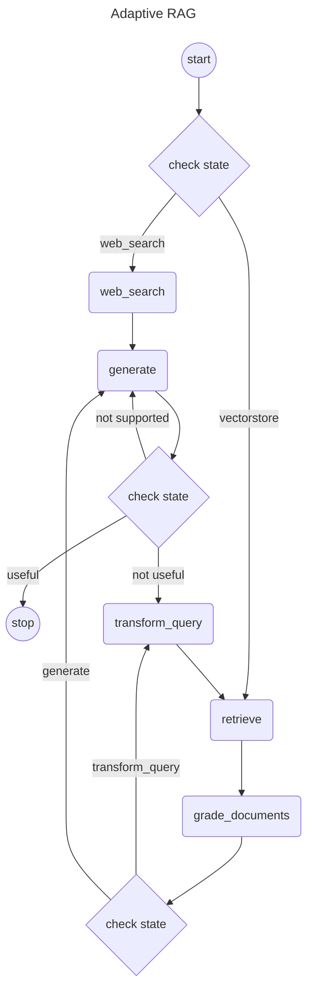

# Langgraph4j - Adaptive RAG

Java implementation of [Adaptive Rag]

[Adaptive Rag]:https://github.com/langchain-ai/langgraph/blob/main/examples/rag/langgraph_adaptive_rag.ipynb

## Mermaid diagram



## PlantUML diagram


## Getting Started

### Populate Chroma Vector store using Docker

1. go to project root (i.e. _cloned project root_)
2. set environment variable `OPENAI_API_KEY`
3. run
   ```
   mvn -pl adaptive-rag exec:exec@upsert
   ```

### Run example

1. go to project root (i.e. _cloned project root_)
2. set environment variable `OPENAI_API_KEY`
3. set environment variable `TAVILY_API_KEY`
4. run
   ```
   mvn -pl adaptive-rag exec:exec@app
   ```

The main is [here](src/main/java/dev/langchain4j/adaptiverag/AdaptiveRag.java)

