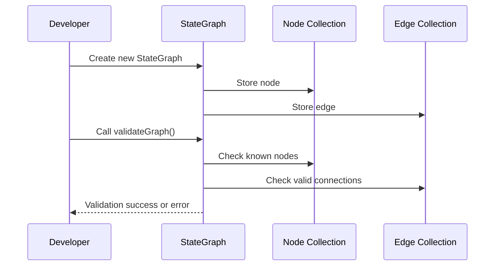

# Chapter 1: StateGraph

Welcome to your very first step in building a stateful, multi-agent application using `langgraph4j`! In this chapter, we'll explore the concept of the **StateGraph**, which acts like the main roadmap of your entire journey. Think of it as a big map that shows you how information flows from one point (node) to another (edge).

---

## What is a StateGraph?

A **StateGraph** is the starting point for defining your processes. It consists of:
- **Nodes**: The key points or “places” in your roadmap (we’ll dig deeper in [Node and Edge](02_node_and_edge.md)).
- **Edges**: The connections or “roads” between those points.

Together, the nodes and edges form a directed path that describes how your data (or “state”) travels and changes throughout your application. The StateGraph ensures everything is valid, checking for broken connections or missing pieces. It also makes it easy to add smaller “sub-routes” (subgraphs) in a well-organized way.

---

## Why Do We Need a StateGraph?

Imagine you have a messaging system that collects user input, processes it, and returns an answer. You want to ensure each step is correct and there’s no confusion about:
1. Which step comes next.
2. What information is passed along.
3. How to gracefully add or modify new steps.

With a **StateGraph**, you can visually plan all the steps, connect them logically, and have the framework automatically check if everything makes sense. If there’s a missing step or a duplicate connection, the StateGraph will notice and let you know.

---

## A Simple Use Case

Let’s say you want to create a small assistant that greets a user, processes a question, and then says goodbye:

1. Start → Greet User
2. Greet User → Process Question
3. Process Question → Say Goodbye

In `langgraph4j`, you can capture this flow using a **StateGraph**.

---

## Building Your First StateGraph

Below is a very simple example of how to create a StateGraph in Java. We’ll skip some details (like how states or actions really work), but this is enough to illustrate the concept.

```java
StateGraph<MyState> graph = new StateGraph<>(myStateFactory);

// 1. Add nodes
graph.addNode("greet", (state) -> {
  // greet user
});
graph.addNode("process", (state) -> {
  // process question
});
graph.addNode("goodbye", (state) -> {
  // say goodbye
});

// 2. Add edges
graph.addEdge(StateGraph.START, "greet");
graph.addEdge("greet", "process");
graph.addEdge("process", "goodbye");
```

**Explanation**:
1. We create a new `StateGraph` that will handle our custom state (`MyState`).
2. We then add three nodes, each representing a specific action (greeting, processing, or saying goodbye).
3. Next, we add edges to show how to travel between these nodes. The `START` node is automatically available in any `StateGraph`.
4. By connecting `START → greet → process → goodbye`, we define the basic user interaction flow.

When you’re ready, you can validate and compile the graph, then run it. Once running, the “state” (i.e., the information) moves through each node in order and executes its corresponding action.

---

## Under the Hood

Internally, the **StateGraph** is storing two important collections:
- A set of **Nodes** (places in your roadmap).
- A list of **Edges** (connections between the places).

When you call methods like `addNode(...)` or `addEdge(...)`, the graph records how everything should be linked. Then, upon validation, it checks if:
- Every node is valid.
- Every edge refers to actual nodes.
- There is a legitimate “start” connection.

### High-Level Sequence

Here’s a high-level look at how this works under the hood when you create and validate a `StateGraph`:



- **You** create and configure the `StateGraph` by adding nodes and edges.
- The `StateGraph` records each node and edge in its internal structures.
- When you validate, it scans through the lists to ensure all references are correct.

---

## Small Peek at the Internal Structure

Inside `core/src/main/java/org/bsc/langgraph4j/StateGraph.java`, it looks something like this (simplified for beginners):

```java
public class StateGraph<State extends AgentState> {

  final Nodes<State> nodes = new Nodes<>();
  final Edges<State> edges = new Edges<>();

  public StateGraph(AgentStateFactory<State> stateFactory) {
    // initialization details
  }

  public StateGraph<State> addNode(String id, AsyncNodeAction<State> action) {
    // checks & adds a node
    return this;
  }

  public StateGraph<State> addEdge(String sourceId, String targetId) {
    // checks & adds an edge
    return this;
  }

  void validateGraph() {
    // ensures no broken roads or missing places
  }
}
```

**Explanation**:
1. We keep track of all the **Nodes** and **Edges** in separate collections.
2. The `addNode(...)` and `addEdge(...)` methods insert the elements into these collections while checking for possible errors (like duplicates).
3. The `validateGraph()` method makes sure the overall roadmap is consistent.

---

## Wrapping Up

In this chapter, we introduced you to the idea of a **StateGraph**—the foundation of your journey in `langgraph4j`. You learned how to:
- Think of the StateGraph as a roadmap of nodes (places) and edges (connections).
- Create and connect a few simple steps to form a meaningful flow.
- Understand the basic internal workings of the StateGraph.

In the [next chapter, Node and Edge](02_node_and_edge.md), we’ll dive deeper into these two critical building blocks to see how they can be customized.

Enjoy the journey ahead!

---

Generated by [AI Codebase Knowledge Builder](https://github.com/The-Pocket/Tutorial-Codebase-Knowledge)