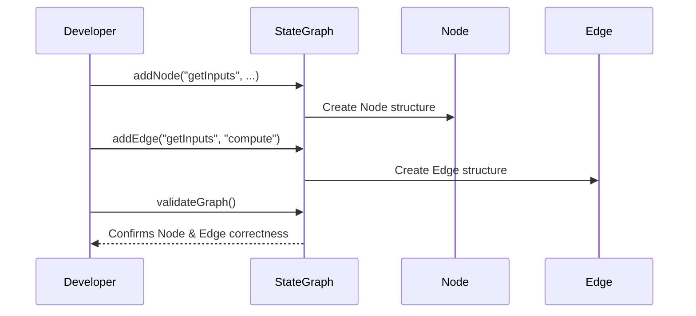

# Chapter 2: Node and Edge

In the [previous chapter, StateGraph](01_stategraph.md), we learned how to outline an entire journey by defining a big roadmap of steps. In this chapter, we'll take a closer look at the essential building blocks of that roadmap: **Nodes** and **Edges**.

---

## Why Nodes and Edges?

Imagine you’re on a long road trip. You need rest stops (places to do specific tasks) and roads connecting these stops. In `langgraph4j`:

- **Node**: A rest stop where something happens or decisions are made.  
- **Edge**: The road that takes you from one stop (node) to another.

This idea helps break down your journey into small, manageable pieces. Each node can do its own job (like greeting a user, processing data, or checking a condition). Meanwhile, edges let you move from one node to the next in a clear, predictable way.

---

## A Quick Use Case

Let’s say you want to build a mini “calculator agent” that adds two numbers and shows the result. How would you organize it?

1. Have a node for receiving inputs.  
2. Have another node for performing the addition.  
3. Finally, have a node for displaying the result.

In this tiny example, each node is responsible for one step, and the edges define how you move from one step to the next.

---

## Defining a Node

A node in `langgraph4j` is created with an identifier (a unique label) and an action to run. In code, it looks like this:

```java
// STEP 1: Define a new node "getInputs"
graph.addNode("getInputs", (state) -> {
  // Code to collect the user's input (e.g., two numbers)
});
```

• The string `"getInputs"` is the node’s unique identifier.  
• The code in the lambda (the `(state) -> { ... }`) is what happens whenever this node is visited.

---

## Connecting Nodes with Edges

Next, we define how to travel from one node to another. In the StateGraph, `START` is a special built-in node representing the beginning of our flow:

```java
// STEP 2: Add an edge from START to "getInputs"
graph.addEdge(StateGraph.START, "getInputs");
```

This tells the system, “After the journey starts, go to `getInputs`.” The second parameter is the node you want to reach.

You can keep adding edges to chain nodes together:

```java
// Connect "getInputs" node to another node, say "compute"
graph.addEdge("getInputs", "compute");
```

---

## Conditional or Parallel Edges (Optional Peek)

Not all edges are simple. In `langgraph4j`, you can:
- Send data to multiple nodes at once (parallel edges).  
- Choose nodes based on conditions (conditional edges).  

For now, just know you have flexibility. The most basic pattern—“go from Node A to Node B”—is enough for most simple scenarios.

---

## Under the Hood: Step-by-Step

Here’s a high-level look at what happens when you add nodes and edges to your graph:



1. You tell the `StateGraph` to create a new node (like `"getInputs"`).  
2. The `StateGraph` (behind the scenes) builds a Node object and stores it.  
3. You tell the `StateGraph` to create an edge from `"getInputs"` to `"compute"`.  
4. The `StateGraph` creates an Edge object and connects those two nodes.  
5. Finally, you validate the graph, ensuring all references are correct.

---

## A Small Example in Code (Put It All Together)

Below is a very short snippet showing how you might link everything:

```java
// 1. Create the StateGraph
var graph = new StateGraph<MyState>(myStateFactory);

// 2. Add a couple of nodes
graph.addNode("getInputs", (state) -> { /* get user numbers */ });
graph.addNode("compute", (state) -> { /* do the addition */ });

// 3. Connect them with edges
graph.addEdge(StateGraph.START, "getInputs");
graph.addEdge("getInputs", "compute");
```

• After creation, the graph knows how to move from `START` → `getInputs` → `compute`.  
• Later chapters will show how to pair these steps with actual code logic or advanced features.

---

## Internal Implementation

`langgraph4j` organizes **Node** and **Edge** in separate classes under the hood:

- [Node.java](../tree/main/core/src/main/java/org/bsc/langgraph4j/internal/node/Node.java)  
- [Edge.java](../tree/main/core/src/main/java/org/bsc/langgraph4j/internal/edge/Edge.java)

### Nodes

A `Node` record keeps:
1. A string `id` for the node’s identifier.  
2. An `actionFactory` (optional) if there’s an associated action.

Whenever you do `graph.addNode("myNode", ...)`, the framework checks if that ID is unique. Then it creates and stores a `Node` object internally.

### Edges

An `Edge` record links a `sourceId` to one or more targets:
1. `sourceId`: The ID of the node where the edge starts (like `"getInputs"`).  
2. `targets`: The possible next destinations. Usually, there’s just one.

By calling `graph.addEdge("source", "target")`, `langgraph4j` creates an `Edge` that references both nodes. During validation, if a node doesn’t actually exist for either side, you’ll get an error.

---

## Conclusion

In this chapter, you discovered:
1. Nodes are “rest stops” where your agent does something (like gathering input or performing calculations).  
2. Edges are “roads” that connect these stops together.  
3. By combining nodes and edges, you mold the structure and flow of your `langgraph4j` application.  

In the next chapter, we’ll explore [Actions (NodeAction, EdgeAction, AsyncNodeAction)](03_actions__nodeaction__edgeaction__asyncnodeaction_.md) to see how these tasks actually come to life when a node or edge is activated. Have fun experimenting with your own nodes and edges in the meantime!

---

Generated by [AI Codebase Knowledge Builder](https://github.com/The-Pocket/Tutorial-Codebase-Knowledge)