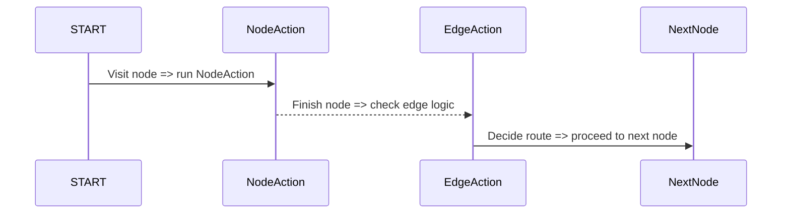

# Chapter 3: Actions (NodeAction, EdgeAction, AsyncNodeAction)

In the [previous chapter, Node and Edge](02_node_and_edge.md), we saw how to build a roadmap of “rest stops” (nodes) and “roads” (edges). But what actually happens at each stop or along the road? That’s where **Actions** step in!

Imagine each node as a place where you can do something fun—like collect information or transform data—and each edge as a decision point that chooses your next destination. In `langgraph4j`, we define these tasks with **NodeAction** and **EdgeAction**. If you want these tasks to be done in the background (without pausing everything else), you can use their asynchronous counterparts (**AsyncNodeAction** and **AsyncEdgeAction**).

---

## Why Actions?

Actions give life to your flow! For example, if you have a node that greets a user, you’ll attach a **NodeAction** that says, “Hello!” or collects user input. Then, when you move to the next node, you might use an **EdgeAction** to decide if you should continue or take a different path. 

They answer questions like:
1. “What do I do with the user’s message at this node?” (NodeAction)
2. “Which road do I take next, based on the user’s answer?” (EdgeAction)

---

## A Tiny “Hello” Use Case

Let’s walk through a super-short scenario:  
• You want a node that greets the user (NodeAction).  
• Then, based on a condition (EdgeAction), decide whether to say “Goodbye” or ask another question.

Below is a sketch of this flow:

1. START → greetNode.  
2. greetNode → [EdgeAction decides if user said “exit”] → nextNode or finalGoodbyeNode.

---

## Key Concepts

### 1. NodeAction

A **NodeAction** runs whenever your agent visits a node. It can:
- Ask a user a question.  
- Modify some internal state.  
- Call an external service.

Code snippet (synchronous NodeAction):

```java
graph.addNode("greetNode", (state) -> {
    // Step 1: Greet the user
    System.out.println("Hello, user!");
    // Step 2: Return any new data
    return Map.of("lastGreeted", true);
});
```

Explanation:  
• “greetNode” is the node where you say “Hello”.  
• You return a `Map<String,Object>` to update or add data to your state (in this example, just a simple flag “lastGreeted”).

---

### 2. EdgeAction

An **EdgeAction** runs whenever you travel along a particular edge. It helps you choose a path or transform info before jumping to the next node.

Code snippet (synchronous EdgeAction):

```java
graph.addEdgeAction("greetNode", (state) -> {
    // Decide next node based on some user response
    if (state.getUserInput().equalsIgnoreCase("exit")) {
        return "finalGoodbyeNode";
    }
    return "askAnotherQuestionNode";
});
```

Explanation:  
• This code decides the outcome (“finalGoodbyeNode” or “askAnotherQuestionNode”) depending on the user’s input stored in `state`.  

---

### 3. Asynchronous Actions

Sometimes, your action might involve a long API call or background process. Instead of blocking the entire system, you can handle it **asynchronously** by using **AsyncNodeAction** or **AsyncEdgeAction**.

Code snippet (asynchronous NodeAction):

```java
graph.addNode("longApiCallNode", (state) -> {
    return CompletableFuture.supplyAsync(() -> {
        // Simulate a long call
        // then return a Map of updates
        return Map.of("apiResult", "success");
    });
});
```

Explanation:  
• With `CompletableFuture`, the node can do its work in the background. Other parts of the system won’t freeze during the call.  
• The result is still a `Map<String,Object>` that updates state afterward.

---

## Putting It Together (Simple Example)

Below is a minimal flow showcasing NodeAction and EdgeAction in a single graph:

```java
// 1. Create the graph
var graph = new StateGraph<MyState>(myStateFactory);

// 2. Node to greet user
graph.addNode("greetNode", (state) -> {
    System.out.println("Hello, user!");
    return Map.of();
});

// 3. Edge from greetNode that decides next step
graph.addEdgeAction("greetNode", (state) -> {
    // choose the route
    return "farewellNode";
});

// 4. Node that says goodbye
graph.addNode("farewellNode", (state) -> {
    System.out.println("Goodbye!");
    return Map.of();
});
```

Here’s what happens at runtime:  
1. The flow starts and runs the “greetNode” NodeAction.  
2. Then the EdgeAction from “greetNode” determines the next node is “farewellNode.”  
3. Finally, the flow arrives at “farewellNode,” which prints “Goodbye!”.

---

## Under the Hood (Step-by-Step)

Let’s look at a simplified process of how actions are triggered inside the graph:



- **START** goes to a node that runs its **NodeAction** code.  
- After that action finishes, we apply the **EdgeAction** to pick the next node.  
- The flow continues until no more nodes are left or you reach an end condition.

---

## A Peek at the Internal Implementation

In `langgraph4j`, each action type has a Java interface that captures its core logic:

1. [NodeAction.java](../tree/main/core/src/main/java/org/bsc/langgraph4j/action/NodeAction.java)  
   - Synchronous node action → returns a `Map<String, Object>`.  
2. [EdgeAction.java](../tree/main/core/src/main/java/org/bsc/langgraph4j/action/EdgeAction.java)  
   - Synchronous edge action → returns a `String` representing the next node ID.  
3. [AsyncNodeAction.java](../tree/main/core/src/main/java/org/bsc/langgraph4j/action/AsyncNodeAction.java)  
   - Asynchronous node action → returns a `CompletableFuture<Map<String,Object>>`.  
4. [AsyncEdgeAction.java](../tree/main/core/src/main/java/org/bsc/langgraph4j/action/AsyncEdgeAction.java)  
   - Asynchronous edge action → returns a `CompletableFuture<String>` for the next node ID.

### Minimal Internal Example

```java
@FunctionalInterface
public interface NodeAction<T extends AgentState> {
    // Synchronous code that updates state info
    Map<String, Object> apply(T t) throws Exception;
}
```

Explanation:  
• Your custom function must take an `AgentState` (`T`) and return a `Map<String,Object>`.  
• Throwing an `Exception` is allowed if your logic hits an error.

---

## Conclusion

Actions are the workers behind the scenes in your flow. **NodeAction** handles what’s done at each stop (node), while **EdgeAction** chooses how to move forward. The asynchronous versions let you keep things running smoothly even if a task takes a long time.

Next, in [CompiledGraph](04_compiledgraph.md), we’ll see how all these pieces (nodes, edges, and actions) come together into a final, validated structure that can be executed or reused. Keep going—you’re constructing a powerful, event-driven application flow!

---

> **Key Takeaways**  
> • Use **NodeAction** to define what happens at each node (collect data, transform info, etc.).  
> • Use **EdgeAction** to pick the next node or path.  
> • Switch to **AsyncNodeAction** or **AsyncEdgeAction** if the task needs time or external resources.  

Happy coding! And see you in the [next chapter, CompiledGraph](04_compiledgraph.md).

---

Generated by [AI Codebase Knowledge Builder](https://github.com/The-Pocket/Tutorial-Codebase-Knowledge)