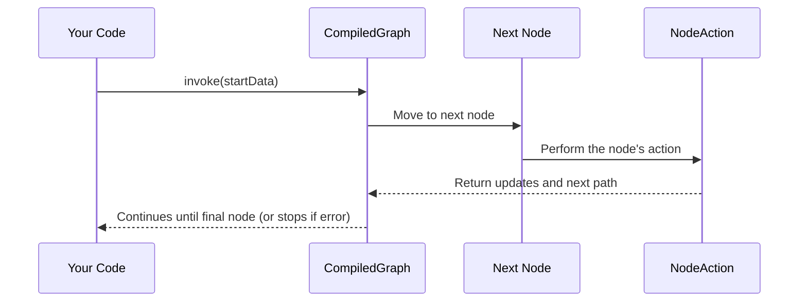

# Chapter 4: CompiledGraph

In the [previous chapter, Actions (NodeAction, EdgeAction, AsyncNodeAction)](03_actions__nodeaction__edgeaction__asyncnodeaction_.md), we discovered how each node and edge can carry out tasks. But how do we turn our entire roadmap (the StateGraph) into something truly “ready-to-run”? Enter the CompiledGraph—where every check, subgraph, and connection is tied up neatly so we can finally drive this “vehicle” from start to finish!

---

## Why CompiledGraph?

Think of the [StateGraph](01_stategraph.md) as a map you carefully designed (with [Nodes and Edges](02_node_and_edge.md) and [Actions](03_actions__nodeaction__edgeaction__asyncnodeaction_.md)). A **CompiledGraph** is when you take that map, confirm every road is safe, every sign is correct, and you turn the key to start rolling. In other words:

1. It reviews every node and edge you defined.  
2. It resolves subgraphs (little side routes you might have embedded).  
3. It produces a single, complete, executable structure.

Once compiled, your app can follow each node in order, do the work, and stop if necessary (like a safety check or an end condition). Without compiling, you just have a raw plan. With compiling, the plan comes alive!

---

## Simple Use Case: Chatbot Flow

Let’s use a short scenario: a chatbot that says hello, processes a question, and says goodbye.

• [StateGraph](01_stategraph.md) has “helloNode,” “processNode,” and “goodbyeNode.”  
• We added edges to link them.  
• We also wrote NodeActions to greet, process, and say goodbye.

But to actually run the process, we need to compile it. The **CompiledGraph** ensures:

• Each node is valid (no missing edges).  
• Each action is recognized (sync or async).  
• The system can step from “helloNode” → “processNode” → “goodbyeNode” with no hiccups.

---

## How to Compile a Graph (Basic Steps)

Below is a shortened snippet to show how you might compile a simple graph. We’ll assume you already defined one:

```java
// 1. Build your StateGraph
StateGraph<MyState> myGraph = new StateGraph<>(myStateFactory);
// ... add nodes & edges ...

// 2. Create a CompiledGraph
CompiledGraph<MyState> compiled = myGraph.compile();
```

Explanation:
• First, you define **myGraph** by adding nodes and edges.  
• Next, you call `myGraph.compile()` to get a fully-baked **CompiledGraph** that’s ready to run.

---

## Running the CompiledGraph

Once you have your **CompiledGraph**, you can invoke it with some initial inputs (for example, a user’s first message). The compiled version returns the final or intermediate state, depending on how you choose to run it.

Example:

```java
// Suppose we have some inputs for the first node
Map<String, Object> startData = Map.of("userMessage", "Hello");

// 3. Run the compiled graph
Optional<MyState> finalState = compiled.invoke(startData);
```

Explanation:
• `startData` is initial info needed by the flow.  
• `compiled.invoke(...)` kicks off the node actions from start to end.  
• `finalState` (if present) holds the last state your app produced.

---

## Under the Hood: Step-by-Step Flow

Compiling merges everything (nodes, edges, actions) into one run-ready graph. At execution time:



1. You call `invoke(...)` on the **CompiledGraph** with some input.  
2. The **CompiledGraph** decides which node to visit first (based on your design).  
3. It runs the node’s action, gets updates, then decides the next node via edges.  
4. That continues until the last node or a special condition (like an error) is reached.

---

## A Quick Peek at the Internal Implementation

In the file [CompiledGraph.java](../tree/main/core/src/main/java/org/bsc/langgraph4j/CompiledGraph.java), you’ll see something like this (simplified):

```java
public class CompiledGraph<State extends AgentState> {
  
    private final StateGraph<State> stateGraph;

    // This map holds the final node actions
    final Map<String, AsyncNodeActionWithConfig<State>> nodes = new LinkedHashMap<>();

    public CompiledGraph(StateGraph<State> stateGraph, CompileConfig compileConfig) {
        this.stateGraph = stateGraph;
        // loads & checks node/edge structure
        // ensures subgraphs are integrated
    }

    public Optional<State> invoke(Map<String,Object> inputs) {
       // runs the compiled flow from START to END
       return Optional.empty(); // simplified placeholder
    }
}
```

Explanation:
1. We store a reference to the `StateGraph` to see how everything was defined.  
2. We create a final set of node actions, each potentially asynchronous.  
3. The `invoke(...)` method is your entry point to run the flow.

Essentially, `CompiledGraph` transforms your blueprint into a trackable, step-by-step machine that can “drive” itself from node to node.

---

## Conclusion

Great job! You’ve now seen how a **CompiledGraph** is where the entire story—nodes, edges, and actions—becomes a travel-ready vehicle. It checks all your definitions, handles subgraphs, and produces a single object you can run or resume as needed. Ready to see how to configure the run process in detail?

Continue to the next chapter: [RunnableConfig](05_runnableconfig.md) to learn how you can adjust settings (like which checkpoint saver to use) when running your freshly CompiledGraph!

---

Generated by [AI Codebase Knowledge Builder](https://github.com/The-Pocket/Tutorial-Codebase-Knowledge)