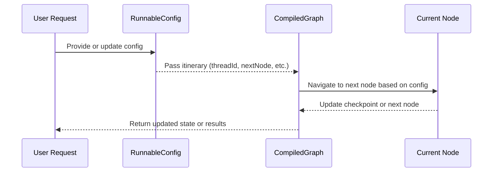

# Chapter 5: RunnableConfig

In the [previous chapter, CompiledGraph](04_compiledgraph.md), you learned how to transform your carefully built roadmap of nodes and edges into a single validated structure. Once you have a compiled graph ready to run, how do you keep track of where your “traveler” (or agent) is on the map, and how do you store little details like checkpoint IDs or which node is next? That’s where the concept of “RunnableConfig” comes in!

---

## Why Do We Need a RunnableConfig?

Think of **RunnableConfig** as the traveler’s itinerary. You have your entire route mapped out (via your CompiledGraph), but you also need specific travel instructions for each trip, such as:
• A unique journey identifier (thread ID).  
• Where you last stopped (checkpoint ID).  
• Which node you plan to visit next.  
• How you want the results to be delivered (stream mode).

These details make sure each traveler (or concurrent run) has its own plan that won’t clash with anyone else’s. When you run your CompiledGraph, you pass along a RunnableConfig so it knows exactly how to proceed.

---

## A Simple Use Case

Imagine you have a helpdesk chatbot:
• Multiple users interact with the same chatbot flow (the same CompiledGraph).  
• Each user session has its own ID, its own last visited node, and possibly a different style of output.  

With **RunnableConfig**, you can store and update these session-specific details so the chatbot always knows where to resume and how to respond for that user.

---

## Creating a Basic RunnableConfig

Below is a super-simple snippet showing how you build a RunnableConfig. It’s purposely short to keep it beginner-friendly:

```java
RunnableConfig config = RunnableConfig.builder()
    .threadId("User-123")
    .checkPointId("CP-Initial")
    .nextNode("helloNode")
    .build();
```

Explanation:  
• `threadId` sets a unique label for this “journey.”  
• `checkPointId` could note where you last stopped or saved your progress.  
• `nextNode` is where this journey should continue in the graph.  
• Finally, `.build()` gives you the ready-to-use **RunnableConfig** instance.

---

## Using RunnableConfig with CompiledGraph

When you actually run your compiled graph, you can do something like:

```java
// Suppose 'compiled' is your CompiledGraph
Optional<MyState> result = compiled.invoke(config);
```

• `config` has all the special instructions (thread ID, nextNode, etc.).  
• `invoke(config)` starts (or resumes) the flow using those instructions.  
• You get back an updated (or final) state in `result`.

---

## Tweaking the Config (On the Fly)

You might need to update the checkPointId or switch the stream mode after a partial run. With **RunnableConfig**, you can create a modified copy and continue. For instance:

```java
RunnableConfig nextConfig = config.withCheckPointId("CP-AfterGreeting");
```

• Instead of altering the original, you get a fresh **RunnableConfig** that updates only what you changed.  
• This helps keep your runs safe and consistent—no accidental overwriting of shared data.

---

## Under the Hood: How It Works Step-by-Step

Here’s a minimal flow of how RunnableConfig interacts with the CompiledGraph at runtime:



1. A **User Request** or your code sets up the config.  
2. That **RunnableConfig** travels into the **CompiledGraph** to guide which node to visit.  
3. The node (and flow) may update checkpoint info or next node for future runs.  
4. The final updated state (and possibly a revised RunnableConfig) comes back to you.

---

## A Glimpse at the Internal Code

Inside [RunnableConfig.java](../tree/main/core/src/main/java/org/bsc/langgraph4j/RunnableConfig.java), you’ll find methods that let you build and modify the config safely:

```java
public final class RunnableConfig {
    private String threadId;
    private String checkPointId;
    private String nextNode;
    private CompiledGraph.StreamMode streamMode = CompiledGraph.StreamMode.VALUES;

    public RunnableConfig withCheckPointId(String checkPointId) {
        // Create a copy and change only the checkpoint ID
        RunnableConfig copy = new RunnableConfig(this);
        copy.checkPointId = checkPointId;
        return copy;
    }
    // ... other similar 'withXyz(...)' methods ...
}
```

Explanation:  
• Each “withXyz(...)” method returns a modified copy of the existing config.  
• This pattern prevents accidental changes to a shared instance.  
• Internally, all fields (threadId, checkPointId, etc.) are stored as private variables.

---

## Conclusion

**RunnableConfig** is your “travel itinerary” whenever you run or resume your CompiledGraph. By storing the thread ID, checkpoint ID, next node, and stream mode, each journey can safely proceed without stepping on another’s toes.

In the next chapter, [Checkpoint](06_checkpoint.md), we’ll dive deeper into how you can pause and restart flows at specific points, and how RunnableConfig plays a key role in making that possible!

---

Generated by [AI Codebase Knowledge Builder](https://github.com/The-Pocket/Tutorial-Codebase-Knowledge)