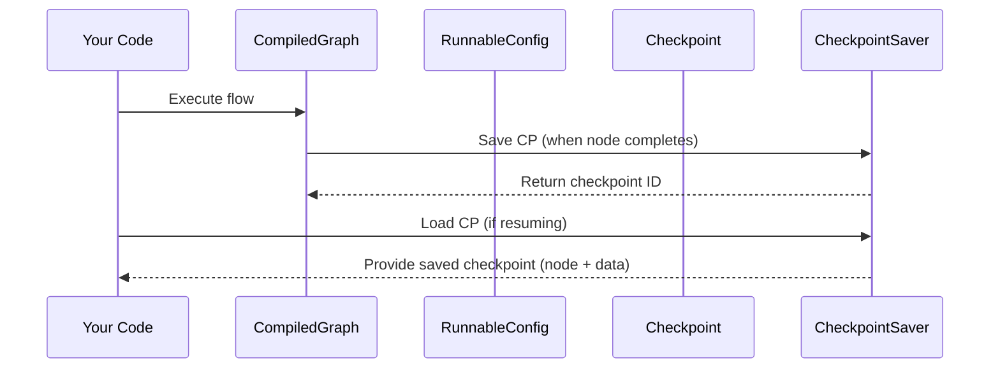

# Chapter 6: Checkpoint

In the [previous chapter, RunnableConfig](05_runnableconfig.md), we learned how to provide “travel instructions” for running or resuming a flow. But what if you want to save your exact spot, so you can quickly return later—like pausing a video game and coming back without losing your progress? That’s where a **Checkpoint** enters the stage!

---

## Why Checkpoints?

A Checkpoint is a snapshot of exactly where your agent is in the graph (which node) and what data it has. Whenever something important happens—like reaching a milestone node—you can “save” a checkpoint. Then, if you ever need to undo a mistake or pick up where you left off, you can load that checkpoint instead of starting from scratch.

Think of it as a “Save Game” feature:
• You store the “player’s location” (node ID).  
• You store the “player’s inventory” (agent’s data).  
• You can resume or rewind your flow whenever necessary.

---

## A Simple Use Case

Imagine a chatbot that asks a user multiple questions:
1. Ask “What’s your name?”  
2. Ask “What’s your favorite color?”  
3. Provide a final greeting.

If the chatbot or user gets disconnected after step 2, you don’t want them to start over. With a checkpoint saved at step 2, you can resume from exactly that spot.

---

## Storing and Loading Checkpoints (Minimal Snippet)

Below is a tiny snippet showing how you might save a checkpoint using a built-in saver (like an in-memory or file-based saver), then later load it. We’ll assume you already have a compiled graph and a runnable config.

```java
// 1. Create or update a checkpoint after a step
checkpointSaver.put(config, myCheckpoint);

// 2. Load a checkpoint to resume
var maybeCheckpoint = checkpointSaver.get(config);
```

Explanation (line by line):  
• (1) “put” saves the current checkpoint (or updates it if it exists).  
• (2) “get” retrieves that checkpoint for later use (like a conversation resume).

---

## Using Checkpoints in Practice

1. Start your flow with a [CompiledGraph](04_compiledgraph.md).  
2. Make a **Checkpoint** the moment you reach a critical node (e.g., the second question).  
3. If the user drops offline, load the checkpoint using the same [RunnableConfig](05_runnableconfig.md) (with the same thread/session ID).  
4. Continue right from where you left off, with no data lost.

Example code (assuming you have a “MemorySaver” or “FileSystemSaver” in place):

```java
// Right after finishing a node:
Checkpoint checkpoint = Checkpoint.builder()
    .id("myCheckpointID")
    .nodeId("question2Node")
    .state(state) // the agent's current data
    .nextNodeId("question3Node")
    .build();

checkpointSaver.put(config, checkpoint); // Save it
```

Explanation:  
• “id” = unique label for your checkpoint (e.g., “myCheckpointID”).  
• “nodeId” = the node we just finished.  
• “nextNodeId” = where we plan to go next.  
• “state” = the agent’s current data so we can restore it later.

---

## Under the Hood (Step-by-Step)

Here’s a quick peek at how a checkpoint is created and restored in a sequence:



1. You run your compiled graph.  
2. The graph calls the “checkpoint saver” at key points to store the agent’s status.  
3. If you later need to resume, you query the saver to retrieve the stored checkpoint.

---

## A Quick Look at the Internal Implementation

### Checkpoint.java (simplified)
Holds the snapshot data, including the node ID and the agent’s current state:

```java
public class Checkpoint {
  private String id;         // e.g. "myCheckpointID"
  private Map<String,Object> state; 
  private String nodeId;     // e.g. "question2Node"
  private String nextNodeId; // e.g. "question3Node"
  // builder pattern for creation
}
```

• `id`: Unique label (often a UUID).  
• `state`: Data snapshot from the agent.  
• `nodeId` & `nextNodeId`: Where we were and where we plan to go next.

### MemorySaver.java (simplified)
An example in-memory saver that keeps checkpoints in a list:

```java
public class MemorySaver implements BaseCheckpointSaver {
  private final Map<String, LinkedList<Checkpoint>> inMemory = new HashMap<>();
  // put/check/load logic
}
```

• Tracks a list of checkpoints per “threadId” (or user ID).  
• `put` saves a checkpoint in the list; `get` reads the latest or a specific one.

---

## Conclusion

Checkpoints are your safety net when building flows with `langgraph4j`. They let you pause and resume without repeating past steps. Combined with [RunnableConfig](05_runnableconfig.md), you can store and load exactly where you left off. Next, we’ll explore [AgentState](07_agentstate.md) to learn how your agent’s data is tracked and updated at each step in the flow.

Keep going—you’re almost there!

---

Generated by [AI Codebase Knowledge Builder](https://github.com/The-Pocket/Tutorial-Codebase-Knowledge)