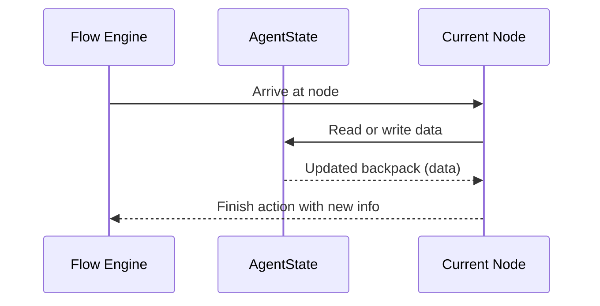

# Chapter 7: AgentState

In the [previous chapter, Checkpoint](06_checkpoint.md), we learned how to save and load snapshots of your journey. But what exactly are you saving each time, and where does all the information about your journey get stored? Meet **AgentState**—the backpack of data that travels with you from node to node!

---

## Why AgentState?

Think of going on a hike. You carry a backpack with supplies, tools, and anything you pick up along the way. In `langgraph4j`, your **AgentState** is this backpack:
• It holds all the data you’ve started with (like initial inputs).  
• It collects new information as you progress (like user responses or intermediate results).  
• It’s always available to read or update at any node or edge.  

No matter how many steps you have in your flow—or even if you pause at a [Checkpoint](06_checkpoint.md)—you never lose what’s inside this AgentState backpack.

---

## A Simple Use Case

Imagine a chatbot that’s gathering information to generate a summary of meeting notes.  
• Step 1: The agent asks for the meeting topic and stores it in the AgentState.  
• Step 2: The agent asks for participants and updates the list in AgentState.  
• Step 3: The agent compiles final notes and presents them—using the stored data.  

As each step finishes, the new data is tucked into the AgentState, so the chatbot always knows exactly what’s been collected.

---

## Key Concepts

### 1. Storing Items

AgentState uses a map (key-value pairs) to organize data. Think of each key as a label on an item in your backpack, and the value as the item itself.

Short snippet:

```java
AgentState state = new AgentState(Map.of("topic", "Team Sync"));
```

• Here, we start our AgentState with an initial key `"topic"`.  
• We can add or modify other keys later as we progress.

### 2. Reading Items

When you want to see what’s in your backpack, simply look it up by key:

```java
Optional<String> topic = state.value("topic");
topic.ifPresent(t -> System.out.println("The topic is: " + t));
```

• We ask for `"topic"` from our AgentState.  
• If it exists, we print it out.

### 3. Updating Items

Whenever you reach a new node, you might gather more data or change what you have:

```java
Map<String, Object> newItems = Map.of("participants", List.of("Alice","Bob"));
Map<String,Object> updatedData = AgentState.updateState(state, newItems, null);
```

• We create a map for the new data (“participants”).  
• We call `AgentState.updateState(...)` to merge it with the existing data in the state.  
• Pass `null` or your own [Channels](08_channels.md) if you need special logic while updating.

---

## How Does AgentState Fit Into the Flow?

When your flow runs (via [CompiledGraph](04_compiledgraph.md) and [RunnableConfig](05_runnableconfig.md)), the AgentState is carried forward at each step. If you decide to [Checkpoint](06_checkpoint.md) along the way, the AgentState is what gets saved.

Below is a small sequence diagram to illustrate:



1. You arrive at a node, which has some action to perform.  
2. The node reads from or updates your AgentState “backpack.”  
3. The updated backpack moves on to the next node.

---

## Under the Hood (Simplified)

Inside [AgentState.java](../tree/main/core/src/main/java/org/bsc/langgraph4j/state/AgentState.java), here’s an ultra-short look:

```java
public class AgentState {
    private final Map<String, Object> data;

    public AgentState(Map<String,Object> initData) {
        this.data = new HashMap<>(initData);
    }

    public Map<String,Object> data() {
        return Collections.unmodifiableMap(data);
    }

    public <T> Optional<T> value(String key) {
        return Optional.ofNullable((T) data.get(key));
    }
}
```

Explanation:  
• `data` is a private `Map` storing your items.  
• The constructor copies any initial data to keep it safe.  
• `value(...)` lets you retrieve an item under a specific key as an `Optional`, making it easy to handle missing items.

---

## Putting It All Together

Let’s do a minimal snippet to tie it into a simple flow:

```java
// 1. Initialize AgentState with a user input item
AgentState state = new AgentState(Map.of("userName", "Alice"));

// 2. Node action reads/writes
String userName = state.value("userName").orElse("Unknown");
System.out.println("User is: " + userName);

// 3. Update state with new data
Map<String,Object> partial = Map.of("message", "Hello, " + userName);
Map<String,Object> merged = AgentState.updateState(state, partial, null);

// 4. The updated data is ready to flow on
System.out.println(merged.get("message"));  // "Hello, Alice"
```

Step-by-step:
1. Start your backpack with a key `"userName"`.  
2. Look it up at the node, printing `"User is: Alice"`.  
3. Merge new data (a welcome message).  
4. The state now includes `"message"` with the text `"Hello, Alice"`.  

---

## Conclusion

**AgentState** is the heart of how data persists and travels through your `langgraph4j` journey. It’s your agent’s backpack, always keeping track of what you’ve learned or accumulated. Use it to store user inputs, intermediate results, or anything else your flow needs.  
 
In the next chapter, we’ll explore advanced ways to update state data with specialized transformations using [Channels](08_channels.md). You’ll see how channels can automatically process or format data as it’s added to the backpack!

Keep exploring—your journey continues!

---

Generated by [AI Codebase Knowledge Builder](https://github.com/The-Pocket/Tutorial-Codebase-Knowledge)