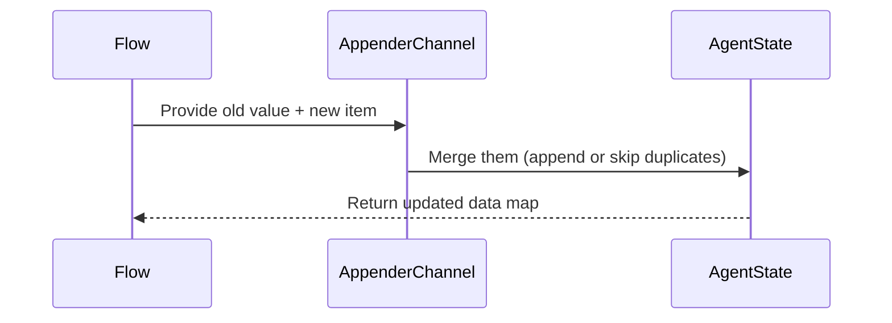

# Chapter 8: Channels

In the [previous chapter, AgentState](07_agentstate.md), we learned how your agent’s data is carried around like a “backpack” across different nodes. Now let’s explore **Channels**—the special lanes that decide how new data merges into the old. Whether you want to simply add new items to a list, remove duplicates, or handle updates in a custom way, Channels let you define those rules neatly.

---

## Why Do We Need Channels?

Imagine you have a digital notepad where, at every step, you might write down a new note. Do you want each new note just appended at the bottom, or do you want to remove duplicates, or maybe combine them differently? **Channels** allow you to set these merging rules. As your agent updates the state, Channels ensure the data is appended or merged exactly how you want.

---

## A Tiny Use Case

Let’s say you’re building a chatbot that collects a list of user responses. Each time the user provides a response:
1. You store that response in your “notes” list.  
2. You might want to avoid duplicates (e.g., if the same response arrives again).  
3. You want it all under a single key, like `"userNotes"` in your `AgentState`.

With Channels, you define how each new response merges with the existing list—whether duplicates are allowed or not.

---

## Key Concepts

### 1. Channel

A **Channel** is like a set of rules for updating a piece of data in the `AgentState` map. Whenever new data arrives for that key, the channel’s logic (its “lane rules”) kicks in to decide how to merge.

### 2. AppenderChannel

An **AppenderChannel** focuses on list-like data:
• “Allow duplicates” mode just appends new items.  
• “Disallow duplicates” mode first checks if an item already exists before adding it.

### 3. Default Values

Channels can also provide a default value the first time your code tries to write to a key. That way, if nothing is there yet, it initializes a new list or object for you.

---

## Using Channels (Minimal Snippets)

Below is a super short snippet to create an appender channel that disallows duplicates:

```java
Channel<List<String>> notesChannel =
    Channels.appender(ArrayList::new);
```
• We call `Channels.appender(...)` and pass `ArrayList::new` to supply a fresh list if the key is empty.  
• By default, this channel will disallow duplicates for new items.

Next, to attach that channel to a specific key (say, `"userNotes"`), you can do:

```java
Map<String,Object> updated =
    AgentState.updateState(
        currentState,
        Map.of("userNotes", "Hello"),
        Map.of("userNotes", notesChannel)
    );
```
Explanation line-by-line:  
1. `currentState`: your existing data.  
2. Map.of("userNotes", "Hello"): the new item you want to add.  
3. Map.of("userNotes", notesChannel): telling the system to use our special channel for “userNotes.”  

After this, the key `"userNotes"` will have a list of strings. If you merge “Hello” again, the channel’s no-duplicate rule will prevent a second “Hello.”

---

## Internal Walkthrough

When you update a piece of data via a channel, here’s what happens under the hood:



1. Your flow passes the old data (“existing list”) plus the new item to the channel.  
2. The channel decides how to merge (append, remove duplicates, etc.).  
3. The final updated list is put back into the `AgentState`.

---

## A Peek Under the Hood (Files)

1. [AppenderChannel.java](../tree/main/core/src/main/java/org/bsc/langgraph4j/state/AppenderChannel.java): Handles list appending logic.  
2. [Channels.java](../tree/main/core/src/main/java/org/bsc/langgraph4j/state/Channels.java): Provides static helpers like `Channels.appender(...)`.  
3. [Channel.java](../tree/main/core/src/main/java/org/bsc/langgraph4j/state/Channel.java): The base interface for all channels.

Here’s a simplified slice of `AppenderChannel` (trimmed to show just the idea):

```java
public class AppenderChannel<T> implements Channel<List<T>> {
  // combine two lists using chosen rule
  private final Reducer<List<T>> reducer;
  private final Supplier<List<T>> defaultProvider;

  @Override
  public Optional<Reducer<List<T>>> getReducer() {
    return Optional.ofNullable(reducer);
  }

  @Override
  public Optional<Supplier<List<T>>> getDefault() {
    return Optional.ofNullable(defaultProvider);
  }

  // Special logic to remove or allow duplicates ...
}
```

• `reducer` decides how two lists should merge.  
• `defaultProvider` supplies the initial list.  
• On an update, it either appends or filters out duplicates.

---

## Conclusion

Channels are the behind-the-scenes drivers that decide how new data merges with existing data in your flow. Whether you need a simple “append everything” approach or a more refined “no duplicates” rule, Channels let you specify it cleanly. Each key in your `AgentState` can have its own rules, giving you total flexibility.

That wraps up our core concepts in `langgraph4j`! You’ve now explored how to define a [StateGraph](01_stategraph.md), link [Node and Edge](02_node_and_edge.md), add [Actions](03_actions__nodeaction__edgeaction__asyncnodeaction_.md), compile your flow ([CompiledGraph](04_compiledgraph.md)), manage run-time details ([RunnableConfig](05_runnableconfig.md)), save checkpoints ([Checkpoint](06_checkpoint.md)), maintain agent data ([AgentState](07_agentstate.md)), and finally, control data merging with Channels. We hope these chapters help you build rich, stateful applications with ease!

---

Generated by [AI Codebase Knowledge Builder](https://github.com/The-Pocket/Tutorial-Codebase-Knowledge)