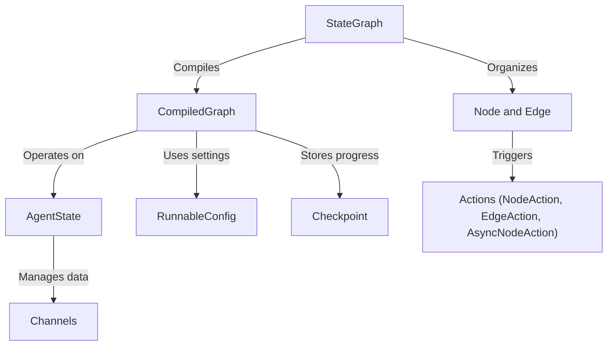

# Tutorial: langgraph4j

**LangGraph4j** provides a way to build *stateful processes* that flow from one node to another
in a **graph-like** structure. It allows embedding subgraphs, managing data checkpoints, and 
resuming execution without losing progress. Each node/edge can run *actions* to transform or 
route data, while *channels* define how information is combined or appended along the journey. 
By compiling your graph, you get a verified, ready-to-run workflow that can pause or continue
reliably anymore.

**Source Repository:** [None](None)

## Chapters

1. [StateGraph](01_stategraph.md)
2. [Node and Edge](02_node_and_edge.md)
3. [Actions (NodeAction, EdgeAction, AsyncNodeAction)](03_actions__nodeaction__edgeaction__asyncnodeaction_.md)
4. [CompiledGraph](04_compiledgraph.md)
5. [RunnableConfig](05_runnableconfig.md)
6. [Checkpoint](06_checkpoint.md)
7. [AgentState](07_agentstate.md)
8. [Channels](08_channels.md)

---

Generated by [AI Codebase Knowledge Builder](https://github.com/The-Pocket/Tutorial-Codebase-Knowledge)