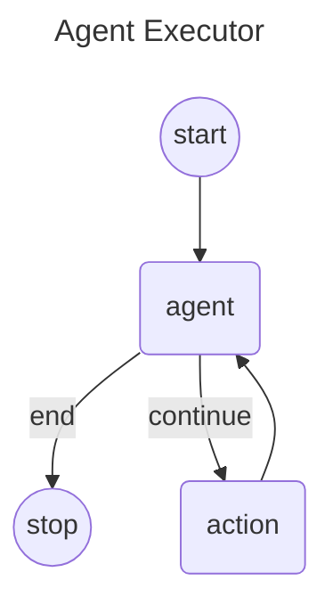

# Langgraph4j - Agent Executor (AKA ReACT Agent)

The "<u>Agent Executor</u>" flow involves a sequence of steps where the agent receives a query, decides on necessary actions, invokes tools, processes responses, iteratively performs tasks if needed, and finally returns a synthesized response to the user. 

This flow ensures that the agent can handle complex tasks efficiently by leveraging the capabilities of various integrated tools and the decision-making power of the language model.

## How to use

```java

public class TestTool {
    private String lastResult;

    Optional<String> lastResult() {
        return Optional.ofNullable(lastResult);
    }

    @Tool("tool for test AI agent executor")
    String execTest(@P("test message") String message) {

        lastResult = format( "test tool executed: %s", message);
        return lastResult;
    }
}

public void main( String args[] ) throws Exception {

    var toolSpecification = ToolSpecification.builder()
            .name("getPCName")
            .description("Returns a String - PC name the AI is currently running in. Returns null if station is not running")
            .build();

    var toolExecutor = (toolExecutionRequest, memoryId) -> getPCName();

    var chatModel = OpenAiChatModel.builder()
            .apiKey( System.getenv( "OPENAI_API_KEY" ) )
            .modelName( "gpt-4o-mini" )
            .logResponses(true)
            .maxRetries(2)
            .temperature(0.0)
            .maxTokens(2000)
            .build();


    var agentExecutor = AgentExecutor.graphBuilder()
                .chatLanguageModel(chatLanguageModel)
                // add object with tools
                .toolFromObjects(new TestTool())
                // add dynamic tool
                .tool(toolSpecification, toolExecutor)
                .build();

    var workflow = agentExecutor.compile();

    var state =  workflow.stream( Map.of( "messages", UserMessage.from("Run my test!") ) );

    System.out.println( state.lastMessage() );
}
```

## Mermaid Diagram




> Go to [code](src/main/java/org/bsc/langgraph4j/agentexecutor)


[agentexecutor]: agentexecutor.puml.png


