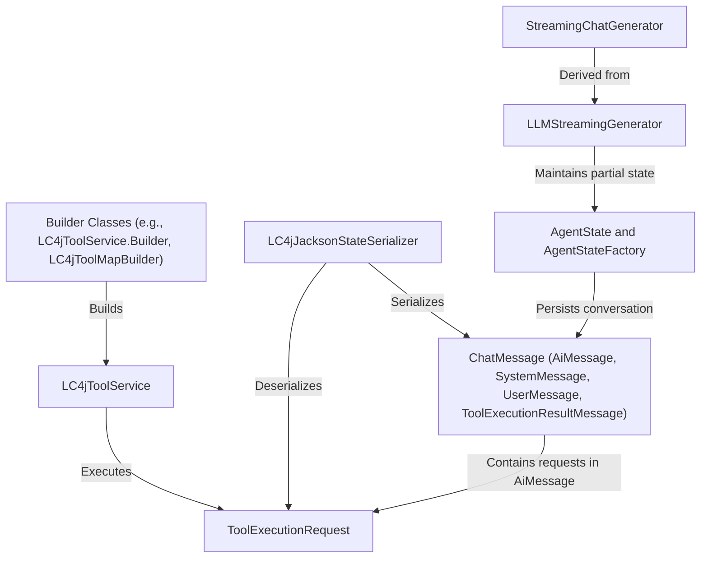

# Tutorial: langchain4j

**langchain4j** helps developers build AI-infused applications with *streaming chat*, 
*tool execution*, and *state serialization*. It defines a toolbox manager (**LC4jToolService**)
to register and run different tools. The *streaming generators* (LLMStreamingGenerator and 
StreamingChatGenerator) yield partial AI responses in real time. 
**LC4jJacksonStateSerializer** converts agent states and messages to/from JSON, 
ensuring conversations and tool executions can be conveniently persisted. 
Overall, the library aims to simplify how your AI agent interacts with external tools 
and how it maintains context across multiple messages.

**Source Repository:** [None](None)

## Chapters

1. [ChatMessage (AiMessage, SystemMessage, UserMessage, ToolExecutionResultMessage)
](01_chatmessage__aimessage__systemmessage__usermessage__toolexecutionresultmessage__.md)
2. [AgentState and AgentStateFactory
](02_agentstate_and_agentstatefactory_.md)
3. [LLMStreamingGenerator
](03_llmstreaminggenerator_.md)
4. [StreamingChatGenerator
](04_streamingchatgenerator_.md)
5. [LC4jToolService
](05_lc4jtoolservice_.md)
6. [ToolExecutionRequest
](06_toolexecutionrequest_.md)
7. [LC4jJacksonStateSerializer
](07_lc4jjacksonstateserializer_.md)
8. [Builder Classes (e.g., LC4jToolService.Builder, LC4jToolMapBuilder)
](08_builder_classes__e_g___lc4jtoolservice_builder__lc4jtoolmapbuilder__.md)

---

Generated by [AI Codebase Knowledge Builder](https://github.com/The-Pocket/Tutorial-Codebase-Knowledge)