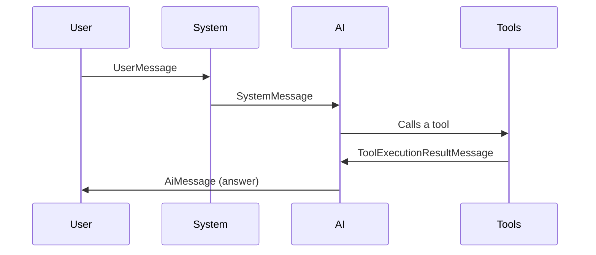

# Chapter 1: ChatMessage (AiMessage, SystemMessage, UserMessage, ToolExecutionResultMessage)

Welcome to your first step in exploring langchain4j! In this chapter, we'll introduce a simple but powerful concept called **ChatMessage**. Think of it as different “envelopes” that hold conversation content, each with a slightly different purpose depending on who’s speaking or what is being said. This helps keep track of the flow of any multi-party conversation—like between you as a user, the system, the AI, and even tools.

---

## Why Do We Need ChatMessage?

When you build conversational applications, many different entities can “speak” or provide messages. For example, you might have:

- A user typing in some text,
- The system giving instructions or clarifications,
- The AI generating a response,
- And sometimes, a tool returning the result of its operation.

Without some clear structure, it’s easy to get lost about who said what. That’s where the **ChatMessage** family steps in!

---

## The Pieces of the ChatMessage Family

Here are the main types of **ChatMessage**:

1. **UserMessage**: Represents the text a real human user types.  
2. **AiMessage**: The AI’s reply back.  
3. **SystemMessage**: Typically instructions or meta-information about how the AI should respond.  
4. **ToolExecutionResultMessage**: The outcome of a tool the AI has called.

They all share a common interface (or shape) called **ChatMessage**, which ensures they can be handled uniformly but still differ in the relevant details.

---

## A Simple Use Case

Imagine you’re building a chatbot to help answer math questions. After a user asks a tricky question, the chatbot might need to call a calculator tool. The flow could look like:

1. The **UserMessage** “What is 3 + 5?” arrives.  
2. The **AiMessage** might say “Let me check the calculation…”  
3. The AI calls the calculator tool behind the scenes.  
4. The tool returns a **ToolExecutionResultMessage** with the result “8.”  
5. Finally, the AI forms an **AiMessage** answer: “The sum is 8.”

Let’s see how we might work with these messages in code.

---

## How to Use Them in Code

Below is a very minimal example of creating these message objects. Each code snippet is kept intentionally tiny and simple.

### UserMessage

```java
// Create a user message with the content "What is 3 + 5?"
UserMessage userMsg = new UserMessage("What is 3 + 5?");
```

Here, `userMsg` holds the text typed by the human user.

### SystemMessage

```java
// Create a system message with instructions for the AI
SystemMessage instructions = new SystemMessage("Always answer truthfully.");
```

The `instructions` message might tell the AI how to behave (like a “policy”).

### AiMessage

```java
// The AI’s reply
AiMessage aiReply = new AiMessage("Let me calculate that...");
```

You can think of `aiReply` as the AI’s direct response to what the user or system said.

### ToolExecutionResultMessage

```java
// The tool’s result from consulting a calculator, for instance
ToolExecutionResultMessage toolResult =
    new ToolExecutionResultMessage("CalculatorTool", "8", "result123");
```

`toolResult` encapsulates whatever the tool did or found out—like the answer to a math problem.

---

## Under the Hood: How Does ChatMessage Work?

When you send these messages around, **langchain4j** uses common interfaces so it knows how to serialize (turn them into data to store or send) and deserialize (read them back). Let’s take a very short look at the typical flow:



1. **User** sends in a UserMessage.  
2. **System** might add SystemMessage instructions.  
3. **AI** processes the input, then calls **Tools**.  
4. **Tools** return a ToolExecutionResultMessage to the AI.  
5. **AI** responds back with an AiMessage.

Under the hood, these messages are handled by classes like `ChatMesssageSerializer` (in `ChatMesssageSerializer.java`) to store and load them. For example, here is a simplified part of its `write` method:

```java
// Pseudocode representing the logic
public void write(ChatMessage msg, ObjectOutput out) throws IOException {
    // Write what kind of message it is (Ai, User, System, Tool result)
    out.writeObject(msg.type());

    // Depending on the type, we use the correct serializer
    switch (msg.type()) {
        case AI:
            // ...call AiMessageSerializer
            break;
        case USER:
            // ...call UserMessageSerializer
            break;
        case SYSTEM:
            // ...call SystemMessageSerializer
            break;
        case TOOL_EXECUTION_RESULT:
            // ...call ToolExecutionResultMessageSerializer
            break;
    }
}
```

The key takeaway: everything is carefully labeled so that the message content always knows if it’s from the AI, the user, the system, or a tool.

---

## Conclusion

You’ve now seen how **ChatMessage** and its specialized forms (**AiMessage**, **UserMessage**, **SystemMessage**, **ToolExecutionResultMessage**) provide structure to conversation flows. They keep track of who said what and ensure each message type is used for its proper role.

In the next chapter, we’ll explore how the conversation’s state is managed using [AgentState and AgentStateFactory](02_agentstate_and_agentstatefactory_.md). This will help you see how ChatMessages and other data fit together to keep track of your conversation’s context over time!

---

Generated by [AI Codebase Knowledge Builder](https://github.com/The-Pocket/Tutorial-Codebase-Knowledge)