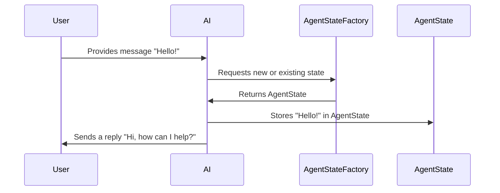

# Chapter 2: AgentState and AgentStateFactory

In the previous chapter [ChatMessage (AiMessage, SystemMessage, UserMessage, ToolExecutionResultMessage)](01_chatmessage__aimessage__systemmessage__usermessage__toolexecutionresultmessage__.md), we looked at how different messages are structured in a conversation. Now, let’s discover how to keep track of that dynamic conversation (and any extra info we might need) using the concepts of AgentState and AgentStateFactory!

---

## Why Do We Need AgentState?

Imagine you’re building a conversational AI that remembers what the user said, the AI’s own responses, and some internal notes on the conversation. You need a place to store this evolving “memory.” That place is the “AgentState.”

- Think of **AgentState** as your AI’s personal notebook.  
- It keeps track of conversation history, any partial results, metadata, or other details.  
- As your conversation evolves, the AI can keep referencing or adding to that notebook.

But who creates or updates that notebook? That is where **AgentStateFactory** comes in. Whenever you need a new AgentState or want to load an existing one, the factory ensures it’s constructed (or updated) properly.  

**Key Benefits:**  
• Avoid rewriting code if you want to store data differently (e.g., in memory vs. a file).  
• Keep your conversation flow consistent across multiple messages.  

---

## Simple Use Case: Tracking the Last Message

Let’s imagine we only want to store the user’s most recent message in the state (to keep it very simple).

1. The user says something.  
2. The AI obtains or creates an **AgentState** from **AgentStateFactory**.  
3. The AI saves the user’s message in the AgentState.  
4. Later, the AI can read the user’s last message from the state to decide how to respond.

Below is a tiny snippet demonstrating a simplified AgentState interface that can store and retrieve a single message.

```java
// A minimal AgentState holding just one "lastUserMessage"
public interface MinimalAgentState extends AgentState {
    void setLastUserMessage(String message);
    String getLastUserMessage();
}
```

In this snippet, `MinimalAgentState` is our “personal notebook” with two methods for storing and retrieving the user’s last message.

---

## How to Use AgentStateFactory

The factory is responsible for creating an instance of `MinimalAgentState`:  

```java
// A simple factory that knows how to build MinimalAgentState
public class MinimalAgentStateFactory implements AgentStateFactory<MinimalAgentState> {

    @Override
    public MinimalAgentState newState() {
        // Return a fresh minimal state
        return new MinimalAgentStateImpl();
    }
}
```

• `newState()` creates and returns a new “notebook.”  
• Real-world code might load from a database or a file instead.  

---

## Putting It All Together

Here’s a mini scenario of how it could look in action:

1. User sends a message.  
2. System/AI uses the factory to get a new or existing AgentState.  
3. That state is updated with the user’s message.  
4. AI can read from the state to formulate a response.



- **U (User)** provides an input.  
- **AI** fetches or creates the AgentState from **AF (AgentStateFactory)**.  
- **AI** updates the state (A) with the user’s data.  
- **AI** uses that info to respond.

---

## Under the Hood: Loading and Saving the State

How does langchain4j actually load or serialize `AgentState`? It often uses the classes like `LC4jStateSerializer` which internally calls the factory to ensure the right type of `AgentState` is built or saved:

```java
// A simplified view of how the serializer might call our factory
public class LC4jStateSerializer<State extends AgentState> {
    
    public LC4jStateSerializer(AgentStateFactory<State> factory) {
        // ...
    }
    
    public State load(byte[] data) {
        // 1) Create new state from factory
        // 2) Fill it with info from data
        return state;
    }
    
    public byte[] save(State state) {
        // Turn the state’s data into bytes
        // ...
        return serializedBytes;
    }
}
```

1. **load**: Creates a fresh state via the factory, then populates it from stored data.  
2. **save**: Turns the state into bytes so it can be stored or sent elsewhere.  

This structure keeps your state creation process consistent.

---

## Conclusion

**AgentState** is the “notebook” that maintains context or metadata for your AI. **AgentStateFactory** is the “workshop” that correctly builds or retrieves that state. With these pieces, you can keep conversation histories, partial tool results, or any other info your AI would need—organized and ready to use.

Next, we’ll see how to generate streaming responses with [LLMStreamingGenerator](03_llmstreaminggenerator_.md). Stay tuned!

---

Generated by [AI Codebase Knowledge Builder](https://github.com/The-Pocket/Tutorial-Codebase-Knowledge)