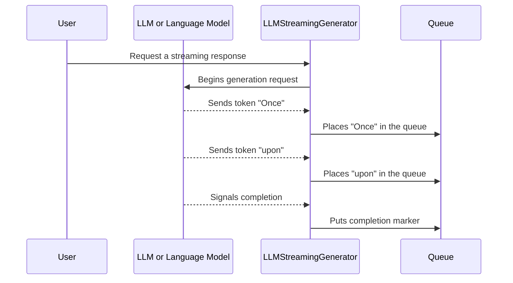

# Chapter 3: LLMStreamingGenerator

In the previous chapter, we explored how to keep track of conversation context and metadata using [AgentState and AgentStateFactory](02_agentstate_and_agentstatefactory_.md). Now, let’s learn about a helpful class for handling token-by-token (or fragment-by-fragment) output from a language model: **LLMStreamingGenerator**.

---

## Why LLMStreamingGenerator?

Think of **LLMStreamingGenerator** like a story narrator who reveals the plot one line at a time, rather than giving you the entire novel in one go. It makes it possible to:

- Receive partial pieces of the AI’s response in real-time.  
- Update your application or user interface instantly whenever a new token (word or phrase) is available.
- Signal when all tokens have arrived so you know the response is complete.

This is extremely useful when you want immediate feedback—like showing a typing effect in a chat interface instead of waiting for the entire message to finish generating.

---

## High-Level Use Case

Let’s imagine you have a web chat where you want the AI’s response to appear chunk by chunk:

1. The user asks, “Tell me a short story about a dragon.”  
2. As soon as the first word is generated (“Once”), it appears on screen.  
3. Then “upon,” then “a,” and so on…  
4. Once the story is fully delivered, the generator signals completion.

This partial-update approach can make your app more dynamic and engaging.

---

## Key Concepts

1. **StreamingResponseHandler**: A helper that receives tokens (strings) one by one, plus a final completion event.  
2. **Async Queue**: An internal queue that collects the tokens as soon as they’re generated.  
3. **Starting Node and Starting State**: Specifies where to begin in your conversation logic and what the current [AgentState](02_agentstate_and_agentstatefactory_.md) is.

---

## How to Use LLMStreamingGenerator

Below is a minimal example of setting it up. We’ll define a simple queue and build our generator:

```java
// Step 1: Create a queue for the streaming tokens (as they arrive)
BlockingQueue<AsyncGenerator.Data<StreamingOutput<MyState>>> queue
    = new LinkedBlockingQueue<>();

// Step 2: Build the LLMStreamingGenerator
LLMStreamingGenerator<String, MyState> generator
    = LLMStreamingGenerator.<String, MyState>builder()
      .queue(queue)
      .startingNode("story-start")
      .startingState(myState)
      .build();
```

Explanation:  
• We first create a `BlockingQueue` that will receive pieces of text.  
• Then we use the builder pattern to set up our `LLMStreamingGenerator`.  
• `startingNode("story-start")` can be any identifier for your conversation flow.  
• `startingState(myState)` refers to the initial [AgentState](02_agentstate_and_agentstatefactory_.md) if you have one.

### Handling the Output Tokens

Once the generator is running, it will place tokens into the queue. You can pull them out to display them:

```java
// Poll the queue to get tokens as they arrive
AsyncGenerator.Data<StreamingOutput<MyState>> tokenData = queue.take();
// If tokenData is done() or error(), handle completion or errors accordingly
```

Explanation:  
• `queue.take()` waits for new data (a partial token or a completion signal).  
• If `tokenData` is an error or a completion event, you know whether to stop or show an error message.  
• Otherwise, you get the piece of text (the token) to show to the user.

---

## Under the Hood: Step-by-Step Flow

Here’s a simplified view of what happens when you run **LLMStreamingGenerator**. We’ll show four participants:



- **User** starts the process by requesting something.  
- **LLM** produces tokens one at a time.  
- **Generator** listens for tokens and places each token into the **Queue**.  
- After the last token is received, a “completion” signal is placed.

---

## A Peek at the Internal Implementation

Inside the file [LLMStreamingGenerator.java](../blob/main/src/main/java/org/bsc/langgraph4j/langchain4j/generators/LLMStreamingGenerator.java), the generator uses a `StreamingResponseHandler<T>` that’s automatically called whenever the language model produces a new part of the text:

```java
// Inside LLMStreamingGenerator’s constructor (simplified)

// This handler is notified each time a new token arrives
this.handler = new StreamingResponseHandler<T>() {
    @Override
    public void onNext(String token) {
        // Place the token into the queue for downstream consumption
        queue.add(AsyncGenerator.Data.of(new StreamingOutput<>(token, startingNode, startingState)));
    }

    @Override
    public void onComplete(Response<T> response) {
        // Place a "done" marker with the final results
        queue.add(AsyncGenerator.Data.done(mapResult.apply(response)));
    }

    @Override
    public void onError(Throwable error) {
        // Place an "error" marker in the queue
        queue.add(AsyncGenerator.Data.error(error));
    }
};
```

Explanation:  
• `onNext(token)` is called for each chunk of text—pushing it into the queue.  
• `onComplete(...)` means we’ve received the last token.  
• `onError(...)` signals that something went wrong.

---

## Conclusion and Next Steps

With **LLMStreamingGenerator**, you can build interactive apps that display the AI response token-by-token, enhancing the user experience through immediate feedback. In simple terms, this tool:

• Listens to a language model’s partial output.  
• Streams each fragment to a queue.  
• Signals when complete or when an error occurs.

Up next, we’ll see how to generate streaming chat responses specifically, using [StreamingChatGenerator](04_streamingchatgenerator_.md). Let’s continue our journey!

---

Generated by [AI Codebase Knowledge Builder](https://github.com/The-Pocket/Tutorial-Codebase-Knowledge)