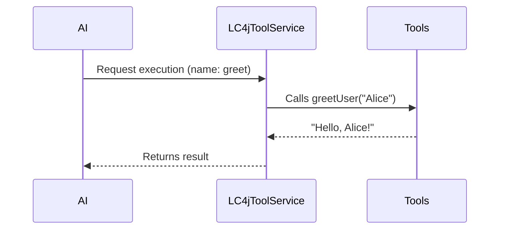

# Chapter 5: LC4jToolService

In the previous chapter [StreamingChatGenerator](04_streamingchatgenerator_.md), we explored how to stream AI responses to create real-time, interactive chat experiences. Now, let’s focus on something equally important: equipping your AI with a set of “tools” it can call upon when needed. This is where **LC4jToolService** shines.

---

## What Is LC4jToolService?

Think of **LC4jToolService** as a helpful “tool manager.” You can pack in different tools (like functions for math, data lookup, or any custom task) and then, whenever the AI requests a tool by name, LC4jToolService finds the right one and executes it. 

Key ideas:  
1. You can register multiple tools—like different wrenches and screwdrivers.  
2. If no tools are registered, a warning is logged (an empty toolbox doesn’t help!).  
3. When a tool is called, LC4jToolService coordinates the actual execution and returns the output.

---

## Example Use Case: Greeting Toolbox

Imagine you want your AI to greet a user by name. You create a simple method that returns a greeting. Let’s see how to register it with LC4jToolService and call it.

### Step 1: Define Your Tool

```java
public class MyToolbox {
    @Tool("greet")
    public String greetUser(@P("username") String username) {
        return "Hello, " + username + "!";
    }
}
```

Explanation:
• The `@Tool("greet")` annotation labels this method as a tool named “greet.”  
• `@P("username")` indicates the parameter your AI will pass.

### Step 2: Create LC4jToolService and Register the Tool

```java
LC4jToolService toolService = LC4jToolService.builder()
    .toolsFromObject(new MyToolbox())
    .build();
```

Explanation:
• `toolsFromObject(new MyToolbox())` scans the class for methods annotated with `@Tool`.  
• `build()` finalizes the service with your tool in the “toolbox.”

### Step 3: Execute a Tool by Name

```java
ToolExecutionRequest request = ToolExecutionRequest.builder()
    .name("greet")
    .arguments("{\"username\": \"Alice\"}")
    .build();

Optional<ToolExecutionResultMessage> result = toolService.execute(request);
```

Explanation:
• `ToolExecutionRequest` tells LC4jToolService which tool (“greet”) to run and its arguments.  
• `execute(...)` runs the tool—if found—and gives you a `ToolExecutionResultMessage`.  
• `result.get().text()` would be “Hello, Alice!”

---

## Under the Hood: How Does It Work?

Let’s see a simplified flow of what happens underneath:



1. The AI asks LC4jToolService to run the tool named “greet.”  
2. LC4jToolService finds and calls the matching method in your toolbox.  
3. The tool runs and returns “Hello, Alice!”  
4. LC4jToolService sends that result back to the AI.

---

## Peek into the Implementation

Under the covers, LC4jToolService stores each tool’s specification (like name and parameter info) and a small executor function. For instance:

```java
// Simplified snippet from LC4jToolService
public Optional<ToolExecutionResultMessage> execute(ToolExecutionRequest request) {
    // 1) Find matching tool by name
    // 2) If found, execute the method
    // 3) Return the result wrapped in ToolExecutionResultMessage
    return ...
}
```

• It loops through available tool specifications, looking for one whose name matches the request.  
• If found, it calls the associated method and packages the output in a `ToolExecutionResultMessage`.

---

## Conclusion

With **LC4jToolService**, you can give your AI a powerful toolbox of methods to call whenever it needs a specialized operation. This is especially useful if you have tasks like data lookups, image processing, or custom calculations. You just plug them into LC4jToolService, and your AI can invoke them by name.

Next, we’ll explore how to structure these tool calls in detail using [ToolExecutionRequest](06_toolexecutionrequest_.md). Stay tuned!

---

Generated by [AI Codebase Knowledge Builder](https://github.com/The-Pocket/Tutorial-Codebase-Knowledge)