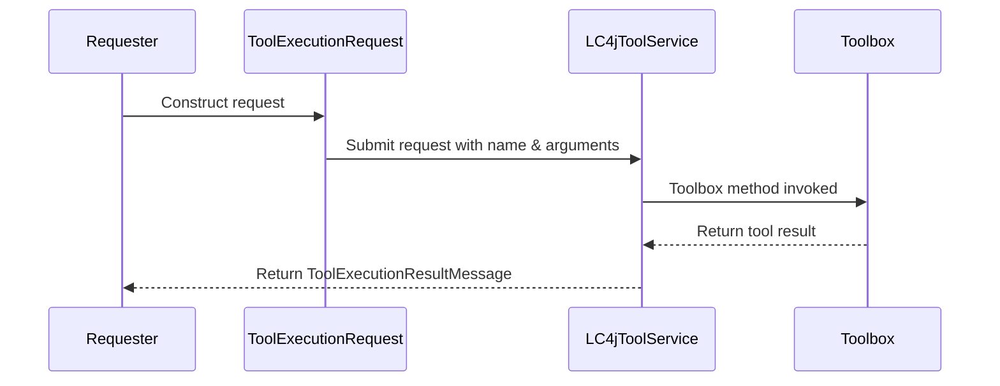

# Chapter 6: ToolExecutionRequest

In the previous chapter [LC4jToolService](05_lc4jtoolservice_.md), we learned how to manage a “toolbox” full of useful methods. Now, let’s see how we formally request any of these tools to run. That’s where **ToolExecutionRequest** comes into play.

---

## Why Do We Need ToolExecutionRequest?

Imagine you’re in a busy workshop and you need a specific task done—like “Please calculate 5 plus 10.” You jot down a short note saying who should do the job (“Calculator Tool”), what you want them to do (“add two numbers”), and the details (“number1: 5, number2: 10”). Then you pass it along, and the shop returns the result.

Here, that “note” is a **ToolExecutionRequest**. It standardizes how we ask a tool to do something, making sure we include:

1. An optional ID for our own tracking.  
2. The name of the tool (e.g., “calculator”).  
3. The arguments in a JSON string (like “{ 'number1': '5', 'number2': '10' }”).

By keeping these three pieces of info in one class, the system always knows which tool to run, what data to pass, and (optionally) how to identify the request.

---

## A Simple Use Case

Let’s use the pancake example from before—but now our AI wants to find out how many pancakes we can make with certain ingredients. Suppose we have a “PancakeCalculatorTool” in our toolbox. We construct a **ToolExecutionRequest** so the AI can ask:

“Please run ‘PancakeCalculatorTool’ with these arguments:
• flourCup: 2  
• eggsCount: 1”

Then, the system returns how many pancakes can be made.

---

## Key Concepts

1. **Request ID (Optional)** – A string you can assign to track this request (e.g., “req-001,” “abc123”).  
2. **Tool Name** – The exact name of the tool to call (e.g., “PancakeCalculatorTool”).  
3. **Arguments** (JSON) – A small JSON string that includes whatever details the tool needs to do its job.

Using these three fields, we clearly describe what we want from any registered tool.

---

## How to Use ToolExecutionRequest

Below is a minimal example. Notice each code block is super short and commented to explain what’s going on.

### Step 1: Build the Request

```java
// Create a new ToolExecutionRequest for a "sumCalculator" tool
ToolExecutionRequest request = ToolExecutionRequest.builder()
    .id("req-123")
    .name("sumCalculator")
    .arguments("{\"number1\": \"5\", \"number2\": \"10\"}")
    .build();
```

Explanation:  
• We’re labeling this request as “req-123” (ID).  
• The tool name is “sumCalculator.”  
• The arguments are a JSON string with two numbers.  

### Step 2: Send Request to LC4jToolService

```java
// Pass the request to your LC4jToolService
Optional<ToolExecutionResultMessage> result = toolService.execute(request);
```

Explanation:  
• We call `execute(request)` on our previously built `toolService`.  
• If this tool is found and runs successfully, we get a `ToolExecutionResultMessage` with the answer.  
• If the tool doesn’t exist or fails, `result` might be empty or contain an error message.

---

## Under the Hood: What Happens?

A quick look under the covers shows how **ToolExecutionRequest** interacts with **LC4jToolService**:



1. We build a **ToolExecutionRequest** with an ID, tool name, and arguments.  
2. That request is passed to the **LC4jToolService**.  
3. **LC4jToolService** finds the matching method in the toolbox (the tool).  
4. The tool method runs and delivers a result back.  
5. The requestor (AI or any other caller) finally gets the output in a `ToolExecutionResultMessage`.

---

## A Closer Peek at the Code Files

Inside the library, the serializers and deserializers ensure **ToolExecutionRequest** can be converted to and from JSON or other formats. For example:

• [ToolExecutionRequestSerializer.java](../blob/main/src/main/java/org/bsc/langgraph4j/langchain4j/serializer/jackson/ToolExecutionRequestSerializer.java) – Takes a `ToolExecutionRequest` and writes it out as JSON with fields “id,” “name,” and “arguments.”  
• [ToolExecutionRequestDeserializer.java](../blob/main/src/main/java/org/bsc/langgraph4j/langchain4j/serializer/jackson/ToolExecutionRequestDeserializer.java) – Reads JSON data and constructs the appropriate `ToolExecutionRequest` object.

They look a bit like this (simplified):

```java
// Inside ToolExecutionRequestSerializer
gen.writeStartObject();
gen.writeStringField("id", msg.id());
gen.writeStringField("name", msg.name());
gen.writeStringField("arguments", msg.arguments());
gen.writeEndObject();
```

Explanation:  
• Each field (`id`, `name`, `arguments`) is stored in JSON.  
• If `id` is null, it still writes a placeholder.

By having these dedicated serializers, everything is consistent when sending and receiving tool requests.

---

## Conclusion

**ToolExecutionRequest** is your “official form” for asking a particular tool to do a job. With just the tool’s name, arguments, and an optional ID, you standardize how requests are made. This becomes especially important when you have many tools being called often.

In the next chapter, we’ll see how to store (serialize) and load (deserialize) other parts of our conversation and tool requests using [LC4jJacksonStateSerializer](07_lc4jjacksonstateserializer_.md).  

---

Generated by [AI Codebase Knowledge Builder](https://github.com/The-Pocket/Tutorial-Codebase-Knowledge)