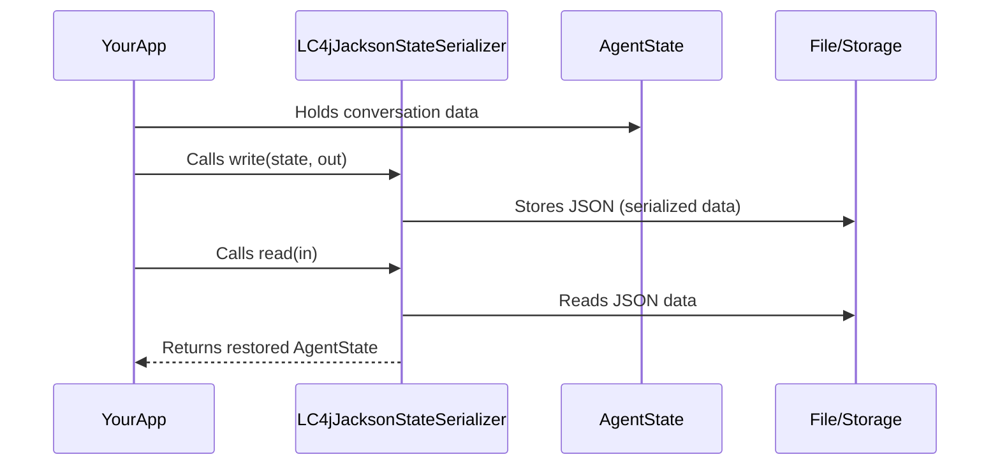

# Chapter 7: LC4jJacksonStateSerializer

In the [previous chapter on ToolExecutionRequest](06_toolexecutionrequest_.md), we explored how to structure requests for invoking any “tool” in your AI’s toolbox. Now, let’s see how to save and restore not just tool requests but all kinds of conversation state (messages, user data, etc.) with the help of LC4jJacksonStateSerializer.

---

## What Is LC4jJacksonStateSerializer?

Picture it as a skillful translator who takes your entire AI “state” (the memory of your conversation, your user’s data, tool requests, etc.) and converts it into JSON. Then, whenever you need that data back, it reads the JSON and reconstructs your objects. It accomplishes this by registering special “modules” for each type of message (like AiMessage, SystemMessage, ToolExecutionResultMessage) so that every piece of your AI’s state is stored or retrieved accurately.

### Why Is It Helpful?
• Makes it easy to persist your conversation state to a file or database.  
• Lets you share conversation data across systems using a well-known JSON format.  
• Automatically understands specialized message types used by langchain4j (AiMessage, etc.).

---

## A Simple Use Case

Imagine you have a chatbot that can remember:
1. Recent user messages (UserMessage).  
2. AI responses (AiMessage).  
3. Any system instructions (SystemMessage).  
4. Tool call results (ToolExecutionResultMessage).  

You want to save this entire conversation so that next time your application restarts, the AI can resume from where it left off. LC4jJacksonStateSerializer will:

1. Take your in-memory conversation (an AgentState object).  
2. Translate it into a JSON-based format.  
3. Write that JSON out (to a file, a database, or wherever you need).  
4. When you load it back, you get the same conversation structure fully restored.

---

## Key Concepts

1. AgentState – The data structure that holds your conversation messages (and other metadata).  
2. Jackson – A powerful Java library for converting objects to JSON and back.  
3. Modules for Specialized Messages – The serializer automatically registers modules so it knows how to interpret AiMessage, SystemMessage, and others.  

---

## How It Works in Practice

Below is a minimal code example showing how to construct the serializer, write some state, and read it back:

### 1) Create the Serializer

```java
LC4jJacksonStateSerializer<MyState> serializer =
    new LC4jJacksonStateSerializer<>(myStateFactory);
```
• Here, `MyState` implements AgentState (holding conversation data).  
• `myStateFactory` is a factory (from [AgentStateFactory](02_agentstate_and_agentstatefactory_.md)) that knows how to build a fresh state object.

### 2) Serialize (Write) the State

```java
try (ObjectOutputStream out = new ObjectOutputStream(...)) {
    serializer.write(myState, out);
}
```
• `myState` is your current conversation data.  
• The serializer turns `myState` into a JSON-based format and writes it out.

### 3) Deserialize (Read) the State

```java
MyState restoredState;
try (ObjectInputStream in = new ObjectInputStream(...)) {
    restoredState = serializer.read(in);
}
```
• Reads the JSON and reconstructs a `MyState` object with all your messages and data intact.

---

## Step-by-Step Flow Under the Hood

Here’s a simplified diagram showing how the serializer transforms and re-creates your state:



1. Your app has an **AgentState** with messages.  
2. You call `write(...)` on the serializer to save that state.  
3. The serializer uses Jackson to convert it to JSON and writes it to storage.  
4. Later, calling `read(...)` does the reverse—loads JSON and rebuilds the **AgentState**.

---

## A Peek Under the Hood (Code Details)

Inside [LC4jJacksonStateSerializer.java], you’ll see something like:

```java
public LC4jJacksonStateSerializer(AgentStateFactory<State> stateFactory) {
    super(stateFactory);

    var module = new SimpleModule();

    // Register specialized message serializers/deserializers
    ChatMessageSerializer.registerTo(module);
    ChatMessageDeserializer.registerTo(module);

    // Register known message types (AiMessage, UserMessage, etc.)
    typeMapper
        .register(new TypeMapper.Reference<AiMessage>("AI") {})
        // ... similar for other message types

    // Hook up the module to Jackson
    objectMapper.registerModule(module);
}
```
1. It sets up a Jackson `SimpleModule`.  
2. It registers specialized ways to handle chat message types.  
3. Finally, it adds this module to an `objectMapper` that performs JSON conversion.

Whenever you call `write(...)` or `read(...)`, this serializer automatically uses these registered modules. That’s why **AiMessage**, **SystemMessage**, and others seamlessly turn into JSON and back without extra code from you.

---

## Conclusion

• LC4jJacksonStateSerializer is your go-to translator for all conversation data.  
• It’s powered by Jackson modules for every specialized message type.  
• Once you set it up, you can confidently save or load entire conversations, tool requests, and more with minimal effort.

Up next, we’ll look at some convenient builder patterns that help you assemble the pieces of your system in [Builder Classes (e.g., LC4jToolService.Builder, LC4jToolMapBuilder)](08_builder_classes__e_g___lc4jtoolservice_builder__lc4jtoolmapbuilder__.md).  

---

Generated by [AI Codebase Knowledge Builder](https://github.com/The-Pocket/Tutorial-Codebase-Knowledge)