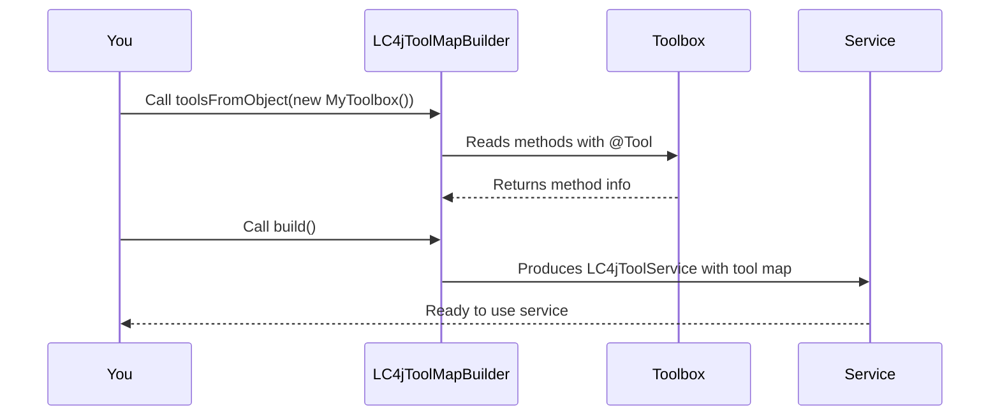

# Chapter 8: Builder Classes (e.g., LC4jToolService.Builder, LC4jToolMapBuilder)

In our [previous chapter on LC4jJacksonStateSerializer](07_lc4jjacksonstateserializer_.md), we explored how to save and load your AI’s entire conversation state. Now, let’s see how to streamline the process of putting various components together using “builder” classes. Specifically, we’ll focus on:

- LC4jToolService.Builder  
- LC4jToolMapBuilder

Builders are like recipe helpers that let us add ingredients step-by-step and then “bake” a final product when we’re ready. This approach improves clarity and reduces the risk of mistakes.

---

## Why Builder Classes?

Imagine making a pizza with a big, complicated recipe. You might have many optional toppings (pepperoni, cheese, olives) and specific instructions (bake time, oven temperature). If you tried to create the pizza in one giant step, you’d risk confusion. Instead, a “pizza builder” helps you add each topping one at a time, adjusting as needed.

In langchain4j, builder classes serve the same purpose:
• You start with a builder.  
• You call methods to add tools and configuration details (like parameters).  
• Finally, you call “build()” to get the finished instance (like a fully configured LC4jToolService).

---

## A Simple Use Case: Building a Tool Service

Let’s say you want to create an LC4jToolService that can handle two tools:  
• “greet” to greet a user by name.  
• “farewell” to say goodbye.

Instead of passing them all at once to a single constructor, you can use the builder pattern to add each tool step-by-step:

### Step 1: Define Your Toolbox

```java
public class MyToolbox {
    @Tool("greet")
    public String greetPerson(@P("name") String name) {
        return "Hello, " + name + "!";
    }

    @Tool("farewell")
    public String sayFarewell(@P("name") String name) {
        return "Goodbye, " + name + "!";
    }
}
```
Explanation:  
• Each method is annotated with `@Tool("...")` so the builder can auto-discover it.  
• We just have two simple methods for greeting and farewells.

### Step 2: Use LC4jToolService.Builder

```java
LC4jToolService service =
    LC4jToolService.builder()
       .toolsFromObject(new MyToolbox())
       .build();
```
Explanation:  
• We start from `LC4jToolService.builder()`.  
• We call `.toolsFromObject(...)` with our `MyToolbox` instance.  
• Finally, `.build()` gives us the fully configured `LC4jToolService`.  

At this point, your `service` object is ready to handle requests for “greet” or “farewell.”

---

## Behind the Scenes: How LC4jToolMapBuilder Works

`LC4jToolMapBuilder` is the underlying mechanism that scans your class for `@Tool` annotations and collects them in a map (the “tool map”). When you call `.build()`, it locks in that map and returns a ready-to-use service.

Here’s a tiny snippet of how it might look internally:

```java
// Inside LC4jToolMapBuilder<T>
public final T toolsFromObject(Object objectWithTools) {
    // For each method marked with @Tool, save method info in a map
    // ...
    return result();
}
```
Explanation:  
• It looks at every method in your toolbox class.  
• If the method has `@Tool("...")`, it stores a small record identifying how to call that method.

---

## Step-by-Step Flow (Under the Hood)

Below is a simplified sequence diagram of what happens when you use the builder to create an LC4jToolService:



---

## Adding More Tools or Specialized Configuration

If you had a bigger project with multiple tools from different classes, you could keep calling `.toolsFromObject(...)` or `.tool(...)`:

```java
LC4jToolService service = LC4jToolService.builder()
    .toolsFromObject(new MathToolbox())
    .toolsFromObject(new DateTimeToolbox())
    .build();
```
Explanation:  
• Each call adds more tools to the building process.  
• The final `.build()` method bakes it all together.

---

## Wrapping Up

Builder classes in langchain4j (like LC4jToolService.Builder or LC4jToolMapBuilder) are powerful but beginner-friendly ways to configure your tools step-by-step. This pattern encourages clarity, letting you add one piece at a time without confusion. Once you finalize configurations, a simple “build()” produces a complete, ready-to-use instance.

That concludes our journey through the main components of langchain4j! You’ve seen how to structure chat messages, manage state, stream responses, execute tools, serialize data, and now how to assemble it all cleanly with builders. By combining these pieces, you can build rich conversational AI applications that are both flexible and maintainable.

Happy building!

---

Generated by [AI Codebase Knowledge Builder](https://github.com/The-Pocket/Tutorial-Codebase-Knowledge)