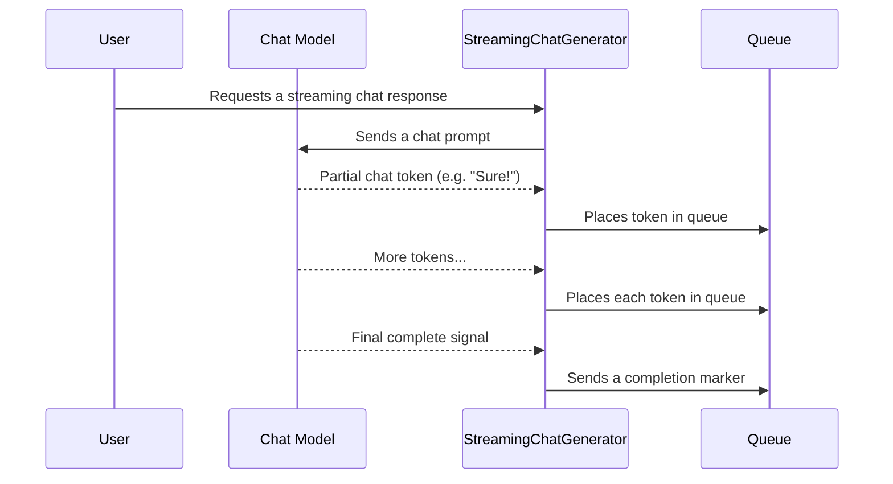

# Chapter 4: StreamingChatGenerator

In the previous chapter [LLMStreamingGenerator](03_llmstreaminggenerator_.md), we explored how to receive responses token-by-token from a language model. Now, let’s dive into a sibling concept called **StreamingChatGenerator**, which focuses specifically on creating interactive, real-time chat experiences. Think of it like chatting with a person who sends each typed word as they go—this helps your app deliver that “live typing” effect for instant feedback.

---

## Why StreamingChatGenerator?

While [LLMStreamingGenerator](03_llmstreaminggenerator_.md) handles generic language streaming, **StreamingChatGenerator** is specialized for chat-specific scenarios. It knows how to handle incoming chat tokens and pass along additional metadata once a response completes. This is incredibly handy for building:

- Streaming chat UIs that display partial responses right away.  
- Command-line interfaces where text appears live as if someone is typing.  
- Real-time dashboards where the AI’s partial insights can be displayed instantly.

---

## Use Case Example: Live Chat

Let’s imagine you’re building a live chat feature. A user asks a question:  
“Hey AI, can you suggest a quick recipe for pancakes?”

As soon as the AI begins responding, each snippet of text (“Sure!”, “To make pancakes,” “you’ll need...”) is streamed to your chat interface. Meanwhile, once the final message is done, you might add extra context or metadata—like an updated conversation state or last-used tool info.

---

## Key Concepts

Here are the main pieces you’ll interact with when using **StreamingChatGenerator**:

1. **StreamingChatResponseHandler** – Listens for partial chat tokens as they arrive.  
2. **AsyncGeneratorQueue** (internally uses a queue) – Temporarily stores the partial responses for consumption.  
3. **AgentState** – Holds any conversation-related data (see [AgentState and AgentStateFactory](02_agentstate_and_agentstatefactory_.md)).  
4. **StreamingOutput** – Wraps each token along with some state/tag info.  

These components work together to deliver a chunk of text at a time, which you can immediately show in your chat interface.

---

## How to Use StreamingChatGenerator

Below is a step-by-step look at a minimal workflow:

### 1) Create a Queue for Output

```java
// Create a queue that will receive partial chat outputs
BlockingQueue<AsyncGenerator.Data<StreamingOutput<MyState>>> queue
    = new LinkedBlockingQueue<>();
```
Explanation:  
• This queue will hold chunks of chat text (tokens). Each time a piece of text arrives, it gets placed here.

### 2) Build the StreamingChatGenerator

```java
// Build the StreamingChatGenerator with custom settings
StreamingChatGenerator<MyState> chatGenerator =
    StreamingChatGenerator.<MyState>builder()
        .queue(queue)
        .startingNode("chat-start")
        .startingState(myStartingState)
        .build();
```
Explanation:  
• You specify the queue, the starting node name, and the initial [AgentState](02_agentstate_and_agentstatefactory_.md) object.  
• Once built, `chatGenerator` knows how to handle incoming partial messages.

### 3) Access the Handler

```java
// Retrieve the handler for partial tokens
StreamingChatResponseHandler handler = chatGenerator.handler();
```
Explanation:  
• This `handler` will receive each partial token from your chat model.  
• You’ll pass `handler` to your chat model or system that generates the text in small pieces.

### 4) Retrieve Tokens & Completion from the Queue

```java
// Later, in a loop, take items from the queue as they arrive:
AsyncGenerator.Data<StreamingOutput<MyState>> data = queue.take();
```
Explanation:  
• Each `data` object can either be a partial token, a completion signal, or an error.  
• You can update your user interface in real time as tokens arrive.

---

## Under the Hood: What Happens Step-by-Step?

Below is a simplified view of how tokens flow:


1. **User** triggers a streaming chat request.  
2. **SCG (StreamingChatGenerator)** passes the request to the **Chat Model (SVC)** for generation.  
3. The model sends back partial tokens.  
4. **SCG** places them in the **Queue (Q)**.  
5. A final “done” marker is delivered when the entire message is generated.

---

## A Closer Look in Code

Inside [StreamingChatGenerator.java](../blob/main/src/main/java/org/bsc/langgraph4j/langchain4j/generators/StreamingChatGenerator.java), each partial token is handled by a `StreamingChatResponseHandler`:

```java
@Override
public void onPartialResponse(String token) {
    // Received a small piece of text from the model
    queue.add(AsyncGenerator.Data.of(new StreamingOutput<>(token, startingNode, startingState)));
}
```
Explanation:  
• Whenever a new token arrives, it’s wrapped in `StreamingOutput` and put in the queue.  

```java
@Override
public void onCompleteResponse(ChatResponse chatResponse) {
    // Model has finished speaking
    queue.add(AsyncGenerator.Data.done(mapResult.apply(chatResponse)));
}
```
Explanation:  
• When the entire message is complete, we create a “done” data item that signals the end of streaming.

---

## Summary & Next Steps

By using **StreamingChatGenerator**, you can build real-time chat experiences where each partial response is sent to the user immediately. This level of responsiveness often results in a more engaging interaction, especially for chat-based apps.

Up next, we’ll see how to integrate tools with your AI workflow using [LC4jToolService](05_lc4jtoolservice_.md). Stay tuned!

---

Generated by [AI Codebase Knowledge Builder](https://github.com/The-Pocket/Tutorial-Codebase-Knowledge)