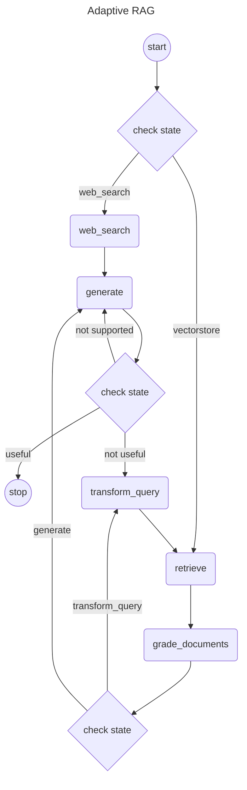

# Langgraph4j - Adaptive RAG

‼️ **PROJECT HAS BEEN RELOCATED TO [langgraph4j/langgraph4j-examples](https://github.com/langgraph4j/langgraph4j-examples)** ‼️
----

> Java implementation of [Adaptive Rag]
## Mermaid diagram

## PlantUML diagram

[Adaptive Rag]:https://github.com/langchain-ai/langgraph/blob/main/examples/rag/langgraph_adaptive_rag.ipynb

