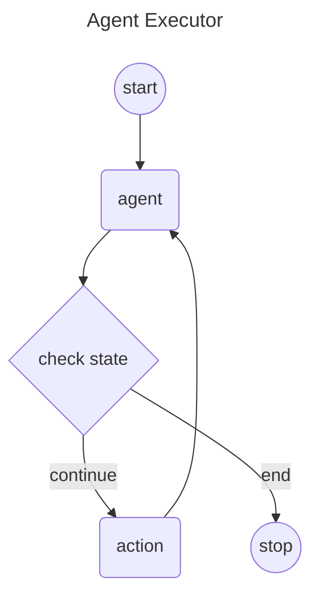

# Langgraph4j - Agent Executor

The "<u>Agent Executor</u>" flow involves a sequence of steps where the agent receives a query, decides on necessary actions, invokes tools, processes responses, iteratively performs tasks if needed, and finally returns a synthesized response to the user. 

This flow ensures that the agent can handle complex tasks efficiently by leveraging the capabilities of various integrated tools and the decision-making power of the language model.

## Mermaid Diagram

## PlantUML Diagram
![diagram][agentexecutor]

***

> Go to [code](src/main/java/dev/langchain4j/agentexecutor)

[agentexecutor]: agentexecutor.puml.png

