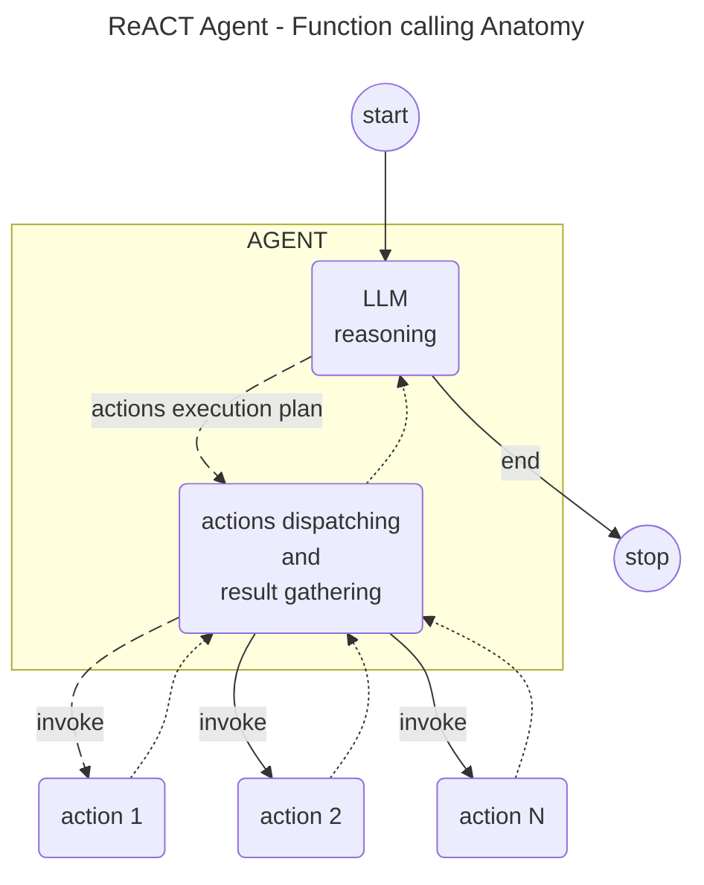
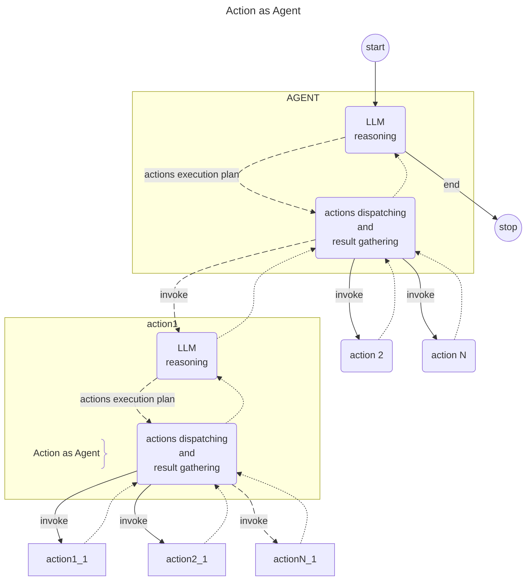
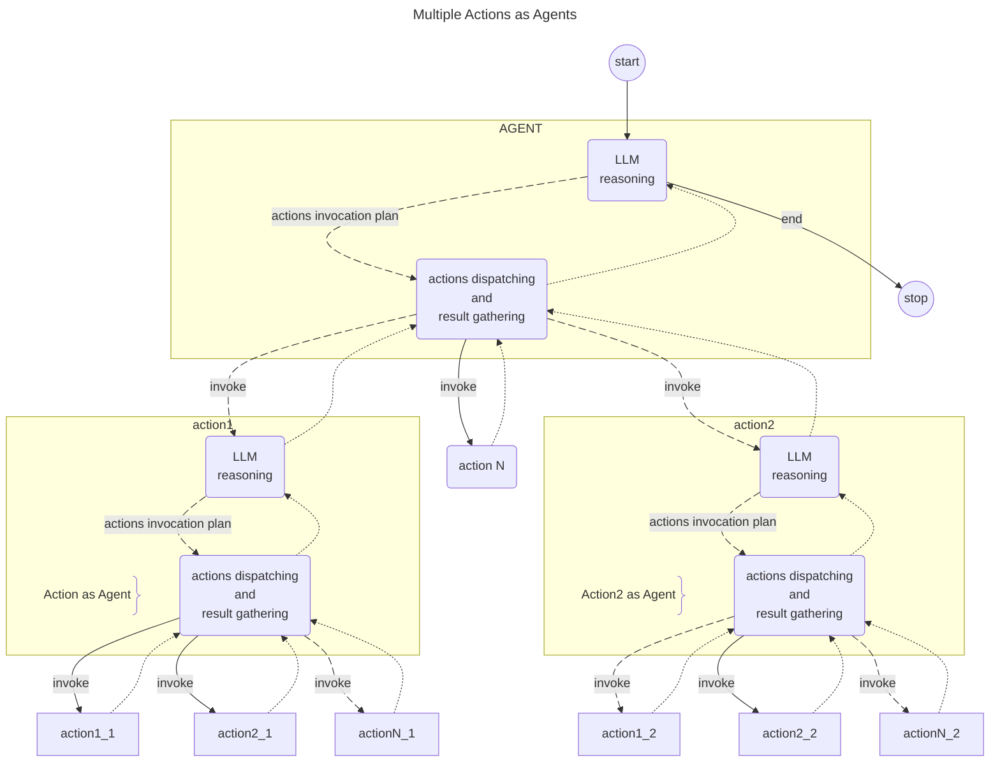

# Langgraph4j - Multi-Agent handoff

‼️ **PROJECT HAS BEEN RELOCATED TO [langgraph4j/langgraph4j-examples](https://github.com/langgraph4j/langgraph4j-examples)** ‼️
----

##  Understanding Multi-Agent Architecture 

Multi-agent systems consist of multiple interacting agents, each designed to perform specific tasks. These agents can be homogeneous or heterogeneous, functioning independently or collaboratively to achieve common goals. The essence of multi-agent architecture lies in the coordination and communication among agents, ensuring seamless execution of complex processes. 

## Defining Agents Handoff 

Agents Handoff refers to the mechanism where control and data ( context ) are transferred from one agent to another, enabling continuous and efficient task execution. This concept is pivotal in scenarios where tasks require diverse expertise or when tasks need to be distributed among multiple agents to optimize performance. 

##
How to implement Agents Handoff ?

Before to evaluate possibly solutions take a more deeper look to "function calling" feature and their role in AI model

### The Role of Function Calls in AI Models 

Function calls in AI models serve as the backbone fo agents allowing them to invoke specific functions, share data, and execute tasks collaboratively. By leveraging function calls, developers can design agents that interact dynamically, responding to changes in the environment and adapting to new information in real-time. 

The diagram below show the architecture behind a ReAct Agent

It is interesting to note that the LLM reasoning process creates an **actions plan**, while the agent platform handles **dispatching and gathering results**.
Now, since the LLM (tools enabled) produce a well defined  **actions invocation plan** based on its input to solve the problem he is dealing with, **what about behind the action we have another Agent ?**

and iteratively we can continue to add new agents making complex multi agents scenarios

## Define Agent Roles and Capabilities using function calls 

In this scenario we can consider to defining :

* **Function description**
  > It will become the Agent role and capabilities. This is crucial to feed the LLM in order to produce a "Actions execution plan" that fit for purpose
* **Function parameters**
  > It will be the context on which the agent will operate as input for its LLM.
  > By default it will be just one parameter named 'context'