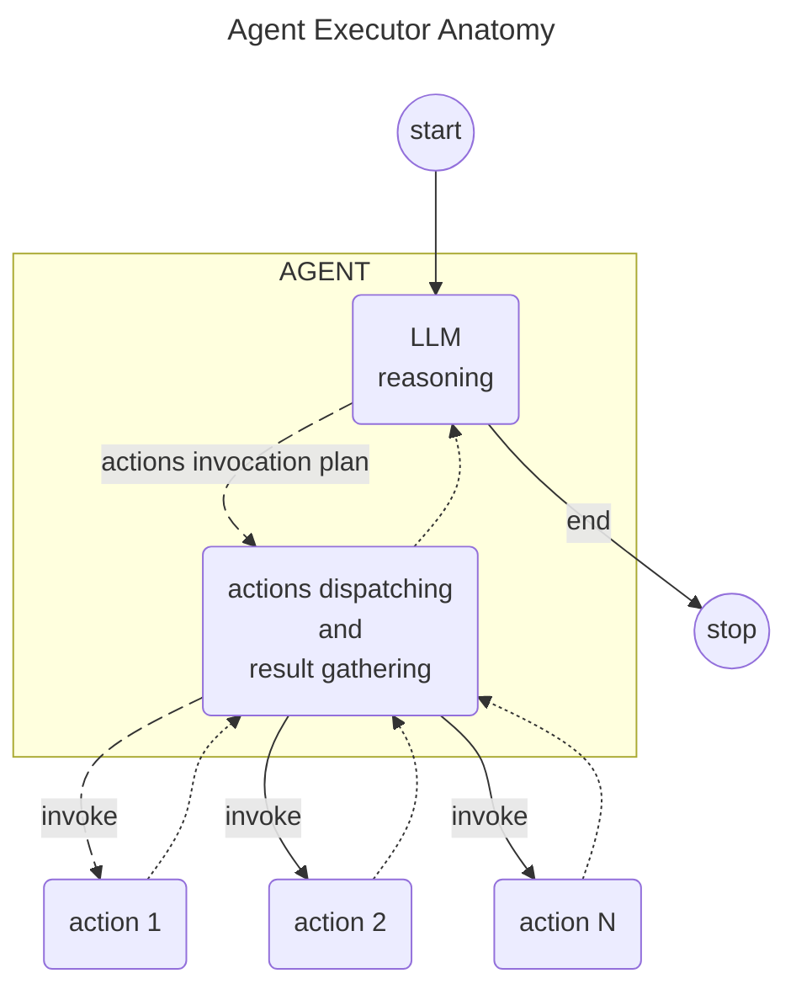
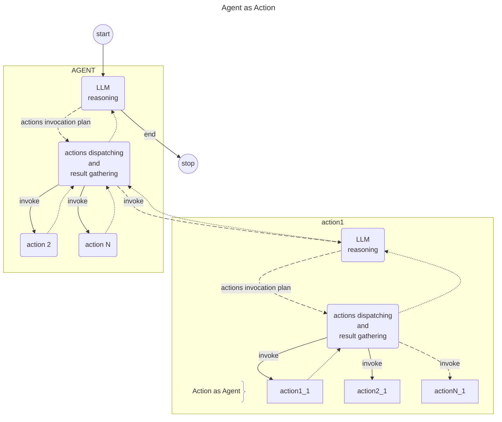
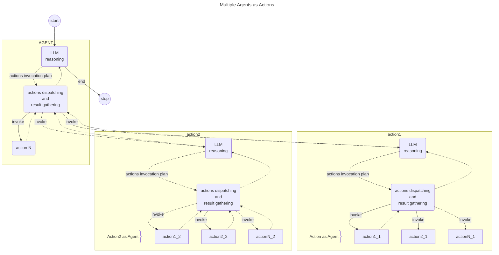

# Langgraph4j - Multi-Agent handoff

```mermaid
---
title: Agent Executor Anatomy
---
flowchart TD
	__START__((start))
	__END__((stop))
    subgraph AGENT
	LLM("LLM
    reasoning") 
	actions("actions dispatching
    and 
    result gathering")
	LLM e1@-->|actions invocation plan| actions
	end
    action1("action 1") 
    action2("action 2") 
    actionN("action N") 
	__START__ --> LLM
	LLM -->|end| __END__
    actions -.-> LLM
    actions e2@-->|invoke| action1
    actions -->|invoke| action2
    actions -->|invoke| actionN

    action1 -.-> actions
    action2 -.-> actions
    actionN -.-> actions

e1@{ animate: true }     
e2@{ animate: true }     
```

```mermaid
---
title: Agent as Action
---
flowchart TD
	__START__((start))
	__END__((stop))
    action1("action 1") 
    action2("action 2") 
    actionN("action N") 
	__START__ --> LLM

    subgraph action1
        A@{ shape: brace-r, label: "Action as Agent" }
        LLM_1("LLM
        reasoning")
    	actions_1("actions dispatching
        and 
        result gathering")
	    LLM_1 e1_1@-->|actions invocation plan| actions_1
        actions_1 -.-> LLM_1
        actions_1 -->|invoke| action1_1
        actions_1 -->|invoke| action2_1
        actions_1 e2_1@-->|invoke| actionN_1
        action1_1 -.-> actions_1
    end

    subgraph AGENT
        LLM("LLM
        reasoning") 
        actions("actions dispatching
        and 
        result gathering")
        LLM e1@-->|actions invocation plan| actions
        actions -->|invoke| action2
        actions -->|invoke| actionN    
        action2 -.-> actions
        actionN -.-> actions
        actions -.-> LLM
  	end

    LLM -->|end| __END__
    
    actions e2@-->|invoke| LLM_1

    LLM_1 -.-> actions

e1@{ animate: true }     
e2@{ animate: true }     
e1_1@{ animate: true }     
e2_1@{ animate: true }     

```

```mermaid
---
title: Multiple Agents as Actions
---
flowchart TD
	__START__((start))
	__END__((stop))
    action1("action 1") 
    action2("action 2") 
    actionN("action N") 
	__START__ --> LLM

    subgraph action1
        A@{ shape: brace-r, label: "Action as Agent" }
        LLM_1("LLM
        reasoning")
    	actions_1("actions dispatching
        and 
        result gathering")
	    LLM_1 e1_1@-->|actions invocation plan| actions_1
        actions_1 -.-> LLM_1
        actions_1 -->|invoke| action1_1
        actions_1 -->|invoke| action2_1
        actions_1 e2_1@-->|invoke| actionN_1
        action1_1 -.-> actions_1
    end
    
    subgraph action2
        B@{ shape: brace-r, label: "Action2 as Agent" }
        LLM_2("LLM
        reasoning")
    	actions_2("actions dispatching
        and 
        result gathering")
	    LLM_2 e1_2@-->|actions invocation plan| actions_2
        actions_2 -.-> LLM_2
        actions_2 e3_2@-->|invoke| action1_2
        actions_2 -->|invoke| action2_2
        actions_2 e2_2@-->|invoke| actionN_2
        action1_2 -.-> actions_2
        action2_2 -.-> actions_2
        actionN_2 -.-> actions_2

    end

    subgraph AGENT
        LLM("LLM
        reasoning") 
        actions("actions dispatching
        and 
        result gathering")
        LLM e1@-->|actions invocation plan| actions
        actions -->|invoke| actionN
        actionN -.-> actions
        actions -.-> LLM
  	end

    LLM -->|end| __END__
    
    actions e2@-->|invoke| LLM_1
    actions e3@-->|invoke| LLM_2

    LLM_1 -.-> actions
    LLM_2 -.-> actions

e1@{ animate: true }     
e2@{ animate: true }     
e3@{ animate: true }     
e1_1@{ animate: true }     
e2_1@{ animate: true }     
e1_2@{ animate: true }     
e2_2@{ animate: true }     
e3_2@{ animate: true }     

```