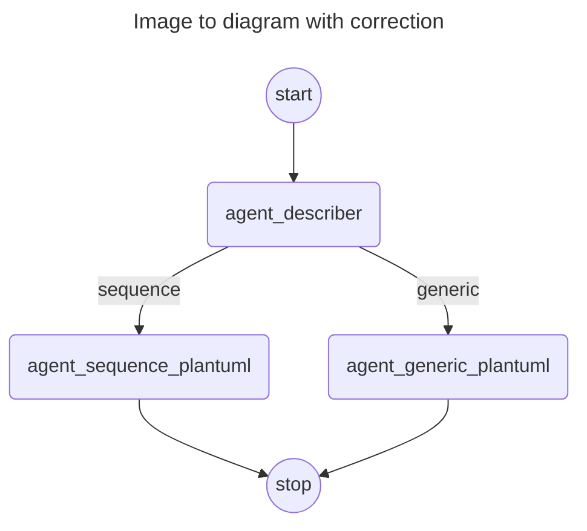
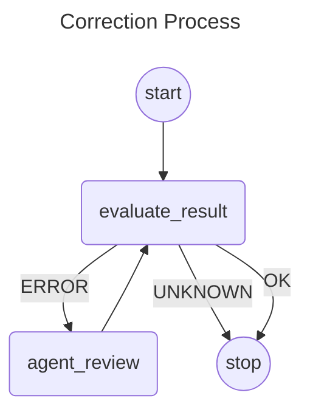
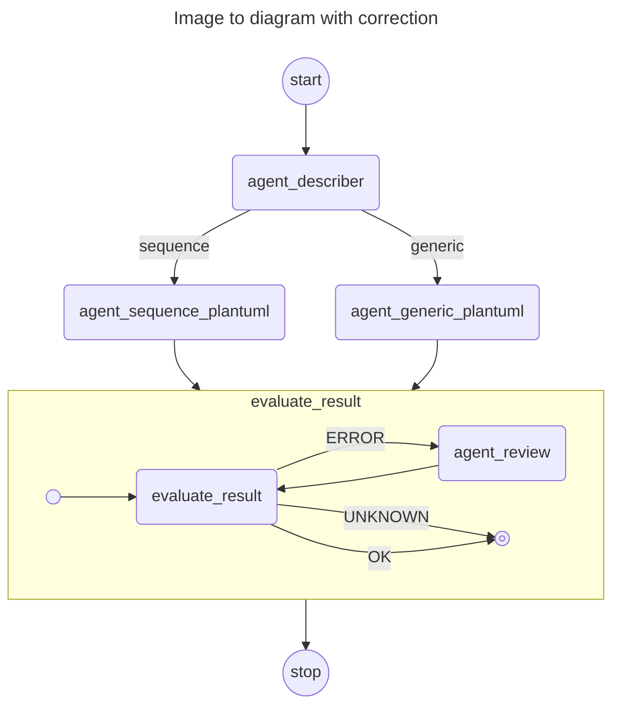

# Langgraph4j - Image To Diagram

‼️ **PROJECT HAS BEEN RELOCATED TO [langgraph4j/langgraph4j-examples](https://github.com/langgraph4j/langgraph4j-examples)** ‼️
----

## Generate PlantUML diagram from Image

The "<u>Generate PlantUML diagram from Image</u>" flow  involves structured sequence of steps. Initially, an agent receives an image and is responsible for analyzing and describing its content. This description is then passed to a specialized agent equipped with the skills to translate the description into PlantUML code. To ensure precision in diagram generation, the type of diagram identified within the image dictates the selection of the appropriately skilled agent for the translation task. This ensures that each diagram type is handled by an agent with specific expertise relevant to that diagram. 

### Diagram of solution

### Handle translation errors

In the case that there are errors in result of PlantUML code we have established a supplementary flow that provided a correction process consisting of iteration between both verification and rewrite steps as shown below

#### Diagram of solution

### Merge All

Finally we can put all together having a complete flow that include also a refinement process over result.

#### Diagram of solution

[agentexecutor]: agentexecutor.puml.png
[image_to_diagram]: image_to_diagram.puml.png
[image_to_diagram_correction]: image_to_diagram_with_correction.puml.png
[correction_process]: correction_process.puml.png

