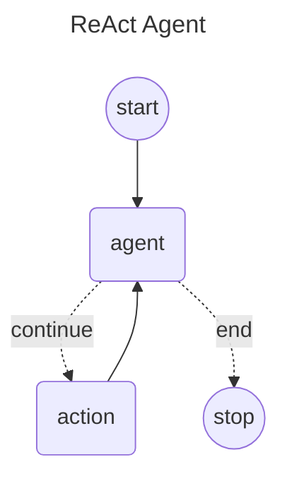

# Langgraph4j and SpringAI AgentExecutor

This is an implementation of ReACT agent in [Spring AI] using Langgraph4j

## Diagram



## Getting Started


```java
@SpringBootApplication
public class SpringAiDemoApplication {
    public static void main(String[] args) {
        SpringApplication.run(SpringAiDemoApplication.class, args);
    }
}
```

### create ChatService

```java
@Service("ollama")
public class OllamaChatService implements ChatService {
    public final List<ToolCallback> tools;
    private final ChatClient chatClient;

    public OllamaChatService( List<ToolCallback> agentFunctions ) {
        this.tools = agentFunctions;
        this.chatClient = chatClientBuilder()
                .defaultSystem("You are a helpful AI Assistant answering questions.")
                .defaultTools(agentFunctions)
                .build();
    }
    
    public List<ToolCallback> tools() { return tools; }

    public ChatResponse execute( List<Message> messages ) {
        return chatClient
                .prompt()
                .messages( messages )
                .call()
                .chatResponse();
    }

    private ChatClient.Builder chatClientBuilder() {

        OllamaApi api = new OllamaApi( );

        var chatOptions = OllamaOptions.builder()
                .model("qwen2.5:7b")
                .temperature(0.1)
                .build();

        var chatModel = OllamaChatModel.builder()
                .ollamaApi( api )
                .defaultOptions(chatOptions)
                .build();

        var toolOptions = ToolCallingChatOptions.builder()
                // IMPORTANT: Disable automatic tool execution
                .internalToolExecutionEnabled(false) 
                .build();

        return ChatClient.builder(chatModel)
                .defaultOptions(toolOptions);
    }


}
```
### create agent executor and run in a console application

```java
@Controller
public class DemoConsoleController implements CommandLineRunner {
    private static final org.slf4j.Logger log = org.slf4j.LoggerFactory.getLogger(DemoConsoleController.class);

    private final ChatService chatService;

    public DemoConsoleController(@Qualifier("ollama") ChatService chatService) {
        this.chatService = chatService;
    }

    @Override
    public void run(String... args) throws Exception {

        var workflow = AgentExecutor.builder()
                        .chatService( chatService )
                        .build()
                        .compile();

        var result = workflow.stream( Map.of( "messages", new UserMessage("what is the result of 234 + 45") ));

        var state = result.stream()
                .peek( s -> System.out.println( s.node() ) )
                .reduce((a, b) -> b)
                .map( NodeOutput::state)
                .orElseThrow();

        log.info( "result: {}", state.lastMessage()
                                    .map(AssistantMessage.class::cast)
                                    .map(AssistantMessage::getText)
                                    .orElseThrow() );
    }
}
```

### BONUS: Create Langgraph4j Studio configuration

```java
@Configuration
public class LangGraphStudioConfiguration extends AbstractLangGraphStudioConfig {

    final LangGraphFlow flow;

    public LangGraphStudioConfiguration(@Qualifier("ollama") ChatService chatService ) throws GraphStateException {

        var workflow = AgentExecutor.builder()
                .chatService( chatService )
                .build();

        this.flow = agentWorkflow( workflow );
    }

    private LangGraphFlow agentWorkflow( StateGraph<AgentExecutor.State> workflow ) throws GraphStateException {

        return  LangGraphFlow.builder()
                .title("LangGraph Studio (Spring AI)")
                .addInputStringArg( "messages", true, v -> new UserMessage( Objects.toString(v) ) )
                .stateGraph( workflow )
                .compileConfig( CompileConfig.builder()
                        .checkpointSaver( new MemorySaver() )
                        .build())
                .build();
    }

    @Override
    public LangGraphFlow getFlow() {
        return this.flow;
    }
}

```
[Spring AI]: https://docs.spring.io/spring-ai/reference/index.html