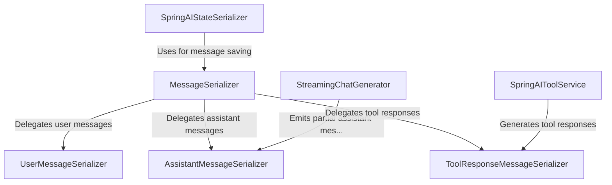

# Tutorial: spring-ai

This project provides tools for **building** and *streaming* AI-driven conversations. 
It can **manage** external “tools” (function callbacks), *save and restore* AI state, 
and **serialize** or *deserialize* different kinds of chat messages.

**Source Repository:** [None](None)

## Chapters

1. [StreamingChatGenerator
](01_streamingchatgenerator_.md)
2. [SpringAIToolService
](02_springaitoolservice_.md)
3. [SpringAIStateSerializer
](03_springaistateserializer_.md)
4. [MessageSerializer
](04_messageserializer_.md)
5. [UserMessageSerializer
](05_usermessageserializer_.md)
6. [AssistantMessageSerializer
](06_assistantmessageserializer_.md)
7. [ToolResponseMessageSerializer
](07_toolresponsemessageserializer_.md)

---

Generated by [AI Codebase Knowledge Builder](https://github.com/The-Pocket/Tutorial-Codebase-Knowledge)