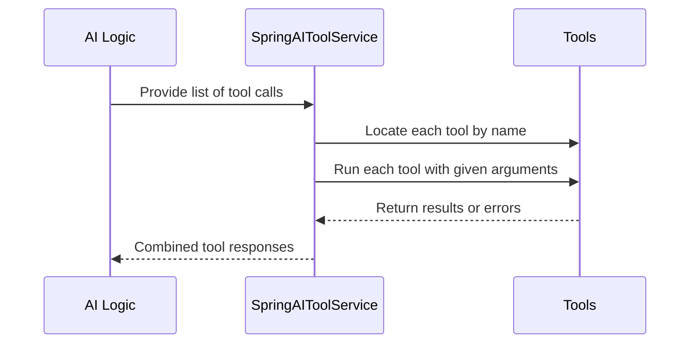

# Chapter 2: SpringAIToolService

In the [previous chapter on StreamingChatGenerator](01_streamingchatgenerator_.md), we explored how an application can send partial chat responses in real time, improving user engagement. Now, let’s talk about a different piece of the puzzle: **SpringAIToolService**. Think of this service as the **library manager** of your AI system—organizing different “tools” (which are basically functions) and activating them when needed.

---

## Why Do We Need SpringAIToolService?

Sometimes, your AI application can’t do everything on its own. For example:

- You might have a function that searches a product database.  
- Another function might handle sending email notifications.  
- A different function might calculate shipping costs.

SpringAIToolService is in charge of keeping track of all these functions in one place. When your AI logic decides it needs to perform a certain task (like “Send an email”), it asks SpringAIToolService to run the matching function. This ensures your AI can use many specialized tools without having to remember where they are or how to call them.

---

## Core Ideas

### 1. Tool Collection

SpringAIToolService stores multiple tools (like a big index of books in a library). When the AI system says, “I need the search tool,” SpringAIToolService looks it up and hands it over.

### 2. Single Entry Point for Calls

All tool-related tasks go through this service. If a tool can’t be found, it will let you know by throwing an error. This centralizes failure handling and makes debugging easier.

### 3. Running the Tools

When a tool is requested, SpringAIToolService provides the correct callback function. It handles any input arguments (like user data) and then returns the output or an exception if the tool call fails.

---

## A Simple Use Case

Imagine you have a chatbot that needs to do the following:

1. Look up the **product inventory** to ensure an item is in stock.  
2. **Send an email** to confirm the order.  

Your chatbot’s AI logic would say something like, “I need to check product availability,” and then “I need to send an email.” SpringAIToolService would locate and run the appropriate tools, returning success or failure.

---

## How to Use SpringAIToolService

Below is a minimal snippet showing how you might retrieve and call a tool. We’ll skip some details to keep things simple.

```java
// Step 1: Get the tool by name
var toolOpt = springAIToolService.agentFunction("checkInventory");

// If the tool is found, call it with arguments (like item "ABC123")
toolOpt.ifPresent(tool -> {
    var output = tool.call(Map.of("itemId", "ABC123"), new ToolContext(Map.of()));
    // Use 'output' however you need
});
```

Explanation:

1. `agentFunction("checkInventory")` looks for a tool named “checkInventory.”  
2. If the tool is found, you can call it with any arguments needed. Here, we pass a `Map` containing `"itemId": "ABC123"`, plus some empty context.

---

### Handling Multiple Tools in One Go

Sometimes, your AI logic might want to run multiple tool calls at once. For example, the AI might say: “First check the inventory, then send an email.” SpringAIToolService can handle a list of requests:

```java
// Step 2: Execute a list of tool calls
var toolCalls = List.of(
    new AssistantMessage.ToolCall("1", "checkInventory", Map.of("itemId","ABC123")),
    new AssistantMessage.ToolCall("2", "sendEmail", Map.of("to","[email protected]"))
);

springAIToolService.executeFunctions(toolCalls)
    .thenAccept(toolResponseMessage -> {
        // toolResponseMessage has all results combined
    });
```

Explanation:

1. We create two tool calls: one for “checkInventory” and one for “sendEmail.”  
2. `executeFunctions(toolCalls)` runs them in sequence, returning a combined response.

---

## What Happens Under the Hood?

Let’s break it down with a small diagram. Suppose your AI system decides to call two tools at once:



1. **AI Logic:** Wants to call specific tools.  
2. **SpringAIToolService:** Finds the tools and runs them.  
3. **Tools:** Actual implementations (like “checkInventory” or “sendEmail”).  
4. **Results:** SpringAIToolService combines the output back to the AI logic.

---

## Internal Implementation Peek

Here are a few key methods in SpringAIToolService (simplified for clarity). They are defined in the file:

src/main/java/org/bsc/langgraph4j/spring/ai/tool/SpringAIToolService.java

### Finding a Tool

```java
public Optional<ToolCallback> agentFunction(String name) {
    // Searches the list of registered tools for a matching name
    return this.agentFunctions.stream()
        .filter(tool -> name.equals(tool.getToolDefinition().name()))
        .findFirst();
}
```

Explanation:  
• This searches through a list of `agentFunctions` (all your tools) and returns the matching one if it exists.  

### Running Multiple Tools

```java
public CompletableFuture<ToolResponseMessage> executeFunctions(
    List<AssistantMessage.ToolCall> toolCalls
) {
    // Orchestrates each call and returns combined results
    return executeFunctions(toolCalls, Map.of());
}
```

Explanation:  
• This method takes a list of “tool calls,” runs them, and eventually produces a `ToolResponseMessage` summarizing all outcomes.  

---

## Conclusion

In this chapter, we explored how **SpringAIToolService** organizes and manages different AI tools, ensuring smooth coordination between your AI’s requests and the actual functions that fulfill them. Think of it as the backstage manager that knows which tool is where and how to invoke it.

Next, we’ll learn about another important building block of the system: [SpringAIStateSerializer](03_springaistateserializer_.md). That’s where we’ll see how conversation states are stored and retrieved, making sure our AI can keep track of everything happening across multiple steps.

Feel free to revisit this chapter whenever you need a refresher on how your AI’s tools are organized. See you in the next chapter!

---

Generated by [AI Codebase Knowledge Builder](https://github.com/The-Pocket/Tutorial-Codebase-Knowledge)