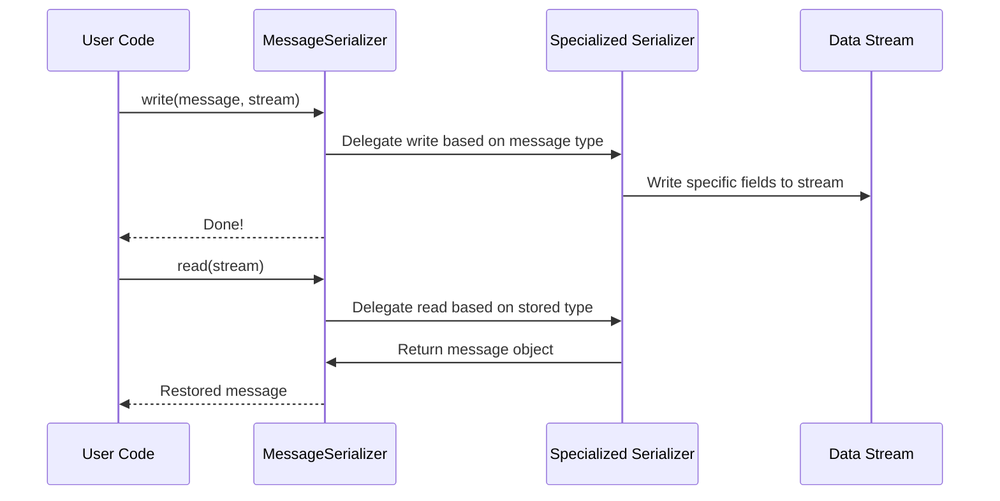

# Chapter 4: MessageSerializer

In the [previous chapter on SpringAIStateSerializer](03_springaistateserializer_.md), we learned how to store and retrieve an AI’s “state” so it doesn’t lose its place. Now, let’s explore a new topic: **MessageSerializer**. You can think of MessageSerializer as a “master translator” for different chat message types (e.g., user messages, assistant replies, system notices, etc.). It decides which specialized serializer to use for each kind of message, ensuring they are saved and loaded correctly.

---

## Why Use MessageSerializer?

Imagine you have multiple types of messages in your conversation:

• A “user message” that a human typed in.  
• An “assistant message” generated by your AI.  
• A “system message” that sets up the context.  
• A “tool response message” with special data from an external resource.

If each message type has its own format, how do you save and load them all without mixing them up? That’s exactly where **MessageSerializer** shines. It detects the message type and hands it off to the right “mini-serializer,” so you never have to guess which rules to follow when storing or restoring each message.

---

## A Simple Use Case

Let’s say you want to:

1. Take a user’s message (“Hello!”).  
2. Write it to a stream (like a file or byte array) for safekeeping.  
3. Later, read that stream back and get the original message object.

With **MessageSerializer**, this is straightforward. It automatically recognizes that our example is a “user message” and delegates the heavy lifting to [UserMessageSerializer](05_usermessageserializer_.md). Meanwhile, if it saw an assistant reply, it would switch to [AssistantMessageSerializer](06_assistantmessageserializer_.md) instead.

---

## Step-by-Step Example

Below is a simplified code snippet showing how to write (serialize) a user message to memory. We’ll skip some details for clarity:

```java
// Step 1: Create a user message
var message = new UserMessage("Hello!");

// Step 2: Create the master serializer
var messageSerializer = new MessageSerializer();

// Step 3: Write the message to a byte stream
ByteArrayOutputStream outStream = new ByteArrayOutputStream();
try (ObjectOutputStream oos = new ObjectOutputStream(outStream)) {
    messageSerializer.write(message, oos);
}
```

Explanation:  
1. We make a `UserMessage` object with the text “Hello!”.  
2. We create our `MessageSerializer` instance.  
3. We use Java’s `ObjectOutputStream` to write our `message` through the serializer.

---

### Loading the Message (Deserialization)

When you’re ready to rebuild the `Message` object from the stored bytes, you can do this:

```java
var inputBytes = outStream.toByteArray();
try (ObjectInputStream ois = new ObjectInputStream(
     new ByteArrayInputStream(inputBytes))) {
    Message restoredMessage = messageSerializer.read(ois);
}
```

Explanation:  
- We turn our saved bytes into an `ObjectInputStream`.  
- `messageSerializer.read(ois)` automatically figures out the message type and reconstructs the correct object for us (in this example, a `UserMessage`).

---

## Under the Hood

Here’s a quick sequence diagram showing how MessageSerializer calls the right specialized serializer behind the scenes:



1. **write(...)**: User code calls `write`. MessageSerializer sees the type (e.g., `USER`) and calls the relevant specialized serializer.  
2. The specialized serializer handles type-specific fields (like “content” for user messages).  
3. **read(...)**: User code calls `read`. MessageSerializer reads the stored message type from the stream.  
4. It picks the correct specialized serializer, which then reconstructs the message object.

---

## Implementation Peek

Below is a trimmed look at the code for MessageSerializer (found in “MessageSerializer.java”). We’ve simplified it to focus on how it switches based on message type:

```java
@Override
public void write(Message object, ObjectOutput out) throws IOException {
    out.writeObject(object.getMessageType());

    switch (object.getMessageType()) {
        case USER -> user.write((UserMessage) object, out);
        case ASSISTANT -> assistant.write((AssistantMessage) object, out);
        case SYSTEM -> system.write((SystemMessage) object, out);
        case TOOL -> tool.write((ToolResponseMessage) object, out);
    }
}
```

Explanation:  
• `getMessageType()` returns something like `MessageType.USER`.  
• The serializer calls the matching serializer (user, assistant, system, or tool).  
• Each specialized serializer knows how to handle the fields for that message type properly.

---

## Conclusion and Next Steps

Congratulations! You now understand how **MessageSerializer** acts as a single entry point for saving and loading any type of chat message. It keeps your code neat by automatically picking which specific serializer to use under the hood.

In the next chapters, we’ll explore each specialized serializer in detail, starting with [UserMessageSerializer](05_usermessageserializer_.md). You’ll see how user messages, assistant replies, and tool responses get their own dedicated logic. Keep going—you’re well on your way to fully mastering the serialization flow in this AI project!

---

Generated by [AI Codebase Knowledge Builder](https://github.com/The-Pocket/Tutorial-Codebase-Knowledge)