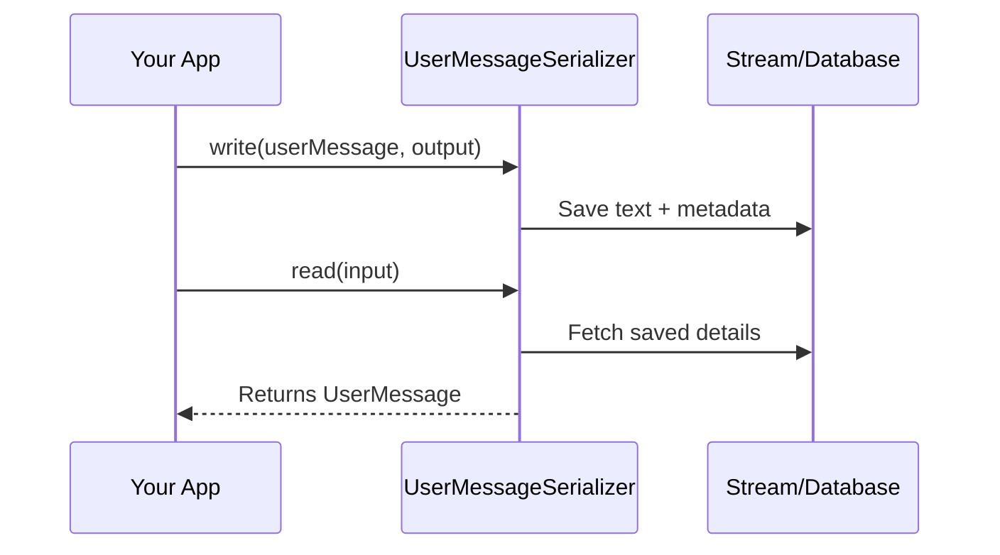

# Chapter 5: UserMessageSerializer

In the [previous chapter on MessageSerializer](04_messageserializer_.md), we saw how different types of messages (like user, assistant, system) are recognized and saved under one “master” serializer. Now, let’s zoom in on a very special piece: **UserMessageSerializer**. Think of it as the specific “seal and envelope” for safely packaging our user’s text and any extra details they bring to the conversation.

---

## Why Do We Need UserMessageSerializer?

Let’s imagine you have a long-running conversation with a user. The user sends messages that may include:

1. A greeting (“Hi there!”).  
2. Follow-up questions (“Can you tell me more about X?”).  
3. Extra data (like a user ID or location info).

When we want to save or transfer these user messages safely (for example, storing them in a conversation log), **UserMessageSerializer** figures out how to label the text, metadata, and other details so that when we restore it, everything is exactly as the user originally typed. It ensures no context is lost in the process.

---

## A Simple Use Case

Consider a customer support chatbot. You might store each user’s message along with metadata:

- The user’s ID or session info.  
- Timestamps or location data.  
- The actual message text.

Later, if you need to reload the conversation from a database or a file, you want to get back those exact words and details so the conversation can smoothly continue. This is precisely what **UserMessageSerializer** does.

---

## How to Use UserMessageSerializer

Below is a super minimal code snippet that demonstrates how you might save (serialize) a user message to an output stream. We’ll keep it under ten lines for simplicity:

```java
// 1. Create a user message
var userMessage = new UserMessage("Hello!", Map.of("userId","12345"));

// 2. Create the serializer
var serializer = new UserMessageSerializer();

// 3. Serialize the user message
serializer.write(userMessage, objectOutputStream);
```

Explanation:  
1. We build a `UserMessage` with some text and a tiny `Map` for metadata.  
2. We instantiate our `UserMessageSerializer`.  
3. We call `write(...)`, which packages the text and metadata onto the stream.

### Reading the User Message (Deserialization)

When you want to load the user message back:

```java
// 1. Read from the same stream
var restoredMessage = serializer.read(objectInputStream);

// 2. We now have the original text and metadata!
System.out.println(restoredMessage.getText());       // "Hello!"
System.out.println(restoredMessage.getMetadata());   // {userId=12345}
```

Explanation:  
• Using `read(...)` reconstructs the original `UserMessage`, text, metadata, and all.

---

## Behind the Scenes: Step-by-Step

Here is a tiny sequence diagram showing what happens when we serialize and deserialize a user message:



1. Your app calls `write(...)` with a `UserMessage`.  
2. UserMessageSerializer writes the text and metadata.  
3. Later, your app calls `read(...)` on the same stored content.  
4. UserMessageSerializer rebuilds the exact `UserMessage` with text and metadata intact.

---

## Under the Hood (Code Peek)

Below is a simplified excerpt from the real `UserMessageSerializer` (found in “UserMessageSerializer.java”). Note that we’re skipping some minor details to keep it beginner-friendly:

```java
@Override
public void write(UserMessage object, ObjectOutput out) throws IOException {
    // 1. Write the text (cannot be null)
    out.writeUTF(object.getText());
    // 2. Write metadata (like userId)
    out.writeObject(object.getMetadata());
}

@Override
@SuppressWarnings("unchecked")
public UserMessage read(ObjectInput in) throws IOException, ClassNotFoundException {
    // 1. Read the text
    var text = in.readUTF();
    // 2. Read the metadata
    var metadata = (Map<String, Object>) in.readObject();
    return new UserMessage(text, metadata);
}
```

Explanation:  
- `write(...)` first writes the message’s text, then the metadata map.  
- `read(...)` pulls the text back out, then reconstructs the metadata into a `Map<String, Object>`.

---

## Conclusion

You’ve just learned how **UserMessageSerializer** neatly packages a user’s text and details so they can be stored and restored without losing context. It ensures the conversation can pick up exactly where the user left off.

Next, we’ll look at [AssistantMessageSerializer](06_assistantmessageserializer_.md), which handles how the AI’s own replies are serialized in a similar fashion. This way, user messages and assistant messages can both be seamlessly preserved in your conversation logs!

---

Generated by [AI Codebase Knowledge Builder](https://github.com/The-Pocket/Tutorial-Codebase-Knowledge)