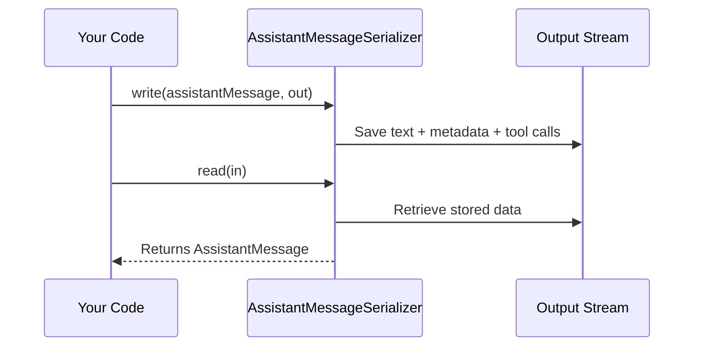

# Chapter 6: AssistantMessageSerializer

In the [previous chapter on UserMessageSerializer](05_usermessageserializer_.md), we explored how to save and restore user messages. Now, it’s time to look at how the AI assistant’s own responses are handled via the “assistant message” serializer. Think of this as a special “shipping box” for the assistant’s replies, ensuring we keep all relevant details (text, tool calls, metadata) in one neat package.

---

## Why Do We Need AssistantMessageSerializer?

When your AI assistant responds, it doesn’t just send text—it may also include:
• Metadata about the response (like timestamps or settings).  
• Special instructions or “tool calls” that ask for extra computing or data retrieval.  

If you want to store these messages for later or transfer them elsewhere, you need a reliable way to keep all this information together. That’s what **AssistantMessageSerializer** does: it bundles each assistant reply into a single package so that when you load it back, you get the exact same message settings, text, and any additional instructions.

---

## A Simple Use Case

Imagine a **travel-planning chatbot** that helps users book flights. When it responds, the assistant might:  
1. Provide flight suggestions in its reply text.  
2. Include metadata about recommended airlines.  
3. Provide tool calls so the application can fetch flight availability.

If your application restarts, you want to pick up right where you left off—still showing those flight suggestions and remembering any pending tool calls. **AssistantMessageSerializer** captures this conversation snapshot so you can safely restore it later.

---

## Key Concepts

1. Text: The main body of the assistant’s message.  
2. Metadata: Extra details (e.g., configuration or context clues).  
3. Tool Calls: Instructions for the application to run certain functions.  

All of these are serialized (saved) and deserialized (loaded) together.

---

## Step-by-Step Example

Below, we’ll see how to store (write) and retrieve (read) an assistant message using minimal code.

### Writing an Assistant Message

```java
// 1. Create an assistant message
var assistantMsg = new AssistantMessage("Flight results:", Map.of("type","recommendation"), List.of());

// 2. Use AssistantMessageSerializer
var serializer = new AssistantMessageSerializer();

// 3. Serialize the message
serializer.write(assistantMsg, objectOutputStream);
```

Explanation:  
• We build an `AssistantMessage` with text (“Flight results:”), some metadata (e.g., `"type":"recommendation"`), and an empty list of tool calls (for now).  
• We create the `AssistantMessageSerializer` instance.  
• Then we write the message to an output stream (like a file or network socket).

### Reading the Assistant Message

```java
// Retrieve the message
AssistantMessage loadedMsg = serializer.read(objectInputStream);

// The AI text & metadata are now restored!
System.out.println(loadedMsg.getText());     // "Flight results:"
System.out.println(loadedMsg.getMetadata()); // {type=recommendation}
```

Explanation:  
• We read from the same stream we used earlier.  
• The `AssistantMessageSerializer` re-creates the original `AssistantMessage` with its text, metadata, and tool calls intact.

---

## How It Works Under the Hood

Here’s a tiny diagram of what happens when we save and load assistant messages:



1. Your code calls `write(...)` with an `AssistantMessage`.  
2. All parts of the message get packaged and written out.  
3. Your code later calls `read(...)`, which reconstructs the saved message.

---

## Internal Implementation Peek

Below is a simplified excerpt from the real file “AssistantMessageSerializer.java” showing how the text, metadata, and tool calls are handled. Notice how each piece is written or read in the same order:

```java
@Override
public void write(AssistantMessage object, ObjectOutput out) throws IOException {
    writeNullableUTF(object.getText(), out);
    out.writeObject(object.getMetadata());
    writeNullableObject(object.getToolCalls(), out);
}

@Override
@SuppressWarnings("unchecked")
public AssistantMessage read(ObjectInput in) throws IOException, ClassNotFoundException {
    var text = readNullableUTF(in).orElse(null);
    var metadata = (Map<String, Object>) in.readObject();
    var toolCalls = (List<AssistantMessage.ToolCall>) readNullableObject(in).orElseGet(List::of);
    return new AssistantMessage(text, metadata, toolCalls);
}
```

Explanation:  
• `write(...)` first writes the text (even allowing for null with `writeNullableUTF(...)`), then stores metadata, then stores any tool calls.  
• `read(...)` performs the opposite steps, reconstructing text, metadata, and tool calls to produce the original `AssistantMessage`.

---

## Conclusion

With **AssistantMessageSerializer**, all of the AI’s reply details are safely tucked into one place, making it easy to store and restore them across multiple sessions. By pairing this serializer with the others you’ve already learned—like [UserMessageSerializer](05_usermessageserializer_.md) and [MessageSerializer](04_messageserializer_.md)—you can confidently keep track of every part of a conversation.

In the next chapter, we’ll explore how to preserve the results from external tools with the aptly named [ToolResponseMessageSerializer](07_toolresponsemessageserializer_.md). This will complete our look at how different message types are packaged and restored. Keep learning, and you’ll have every piece of the conversation flow under your control!

---

Generated by [AI Codebase Knowledge Builder](https://github.com/The-Pocket/Tutorial-Codebase-Knowledge)