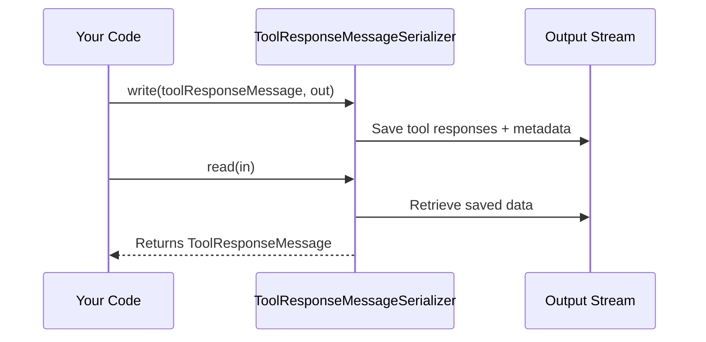

# Chapter 7: ToolResponseMessageSerializer

In the [previous chapter on AssistantMessageSerializer](06_assistantmessageserializer_.md), we learned how to handle the AI assistant’s responses. Now, let’s explore another important piece of the puzzle: how we store and restore data coming from external tools or function calls. That’s where **ToolResponseMessageSerializer** comes in—acting like a dedicated container for any tool-generated replies. 

---

## Why Do We Need ToolResponseMessageSerializer?

Imagine your AI app calls an external “Weather Service” to get the current forecast. This tool might return the temperature, humidity, and a short description (“Sunny”). That’s valuable data you don’t want lost in the conversation history. **ToolResponseMessageSerializer** ensures:
1. All the tool’s response details are cleanly packaged.  
2. You can save and reload that info later, so you remember exactly which tool was called, what it returned, and why.

---

## A Simple Use Case

Let’s consider a chatbot that helps users with travel planning. When the user asks “What’s the weather like in Berlin?” our chatbot might:
1. Call an external weather API (the “tool”).  
2. Receive a response like “Cloudy, 65°F.”  
3. Store that weather data in a dedicated message format.

Later, if your system restarts or you want to revisit the conversation, you need a reliable way to bring back these tool responses without mixing them into user or assistant messages. **ToolResponseMessageSerializer** keeps them separate, tidy, and easy to manage.

---

## Key Concepts

1. Tool Responses: A list of items the external tool returned.  
2. Metadata: Extra context, like which API was called, timestamps, or any debugging info.  
3. Dedicated Container: Everything about the tool’s reply lives in a single “ToolResponseMessage,” ensuring it doesn’t get confused with the user or assistant messages.

---

## Step-by-Step Example

Below is a minimal example showing how to create, store, and load a tool response message.

### 1. Writing the Tool Response

```java
// 1. Create a ToolResponseMessage
var toolResponseMessage = new ToolResponseMessage(
    List.of(new ToolResponseMessage.ToolResponse("weatherService", "Berlin: Cloudy 65F")),
    Map.of("source", "ExternalAPI")
);

// 2. Use ToolResponseMessageSerializer
var serializer = new ToolResponseMessageSerializer();

// 3. Write it to a stream (e.g., file, memory)
serializer.write(toolResponseMessage, objectOutputStream);
```

Explanation:  
• `ToolResponseMessage` holds a list of `ToolResponse` objects (each with a name and data) plus any metadata.  
• We create `ToolResponseMessageSerializer` and call `write(...)` to store this message securely.

### 2. Reading the Tool Response

```java
// 1. Restore it from the same stream
ToolResponseMessage restored = serializer.read(objectInputStream);

// 2. See the returned data
System.out.println(restored.getResponses()); // [("weatherService", "Berlin: Cloudy 65F")]
System.out.println(restored.getMetadata());  // {source=ExternalAPI}
```

Explanation:  
• Using `read(...)` retrieves our original list of tool responses and metadata, ensuring no information is lost.

---

## Under the Hood: What Happens?

Here’s a tiny diagram illustrating how saving and loading might happen:



1. Your code calls `write(...)` with a `ToolResponseMessage`.  
2. **ToolResponseMessageSerializer** writes the list of tool data and metadata.  
3. Later, you call `read(...)` to load it back.  
4. The serializer recreates `ToolResponseMessage` with all of the original data.

---

## Internal Implementation Peek

Below is a snippet from “ToolResponseMessageSerializer.java,” showing how it writes and reads the responses and metadata:

```java
@Override
public void write(ToolResponseMessage object, ObjectOutput out) throws IOException {
    out.writeObject(object.getResponses());
    out.writeObject(object.getMetadata());
}

@Override
@SuppressWarnings("unchecked")
public ToolResponseMessage read(ObjectInput in) throws IOException, ClassNotFoundException {
    var response = (List<ToolResponseMessage.ToolResponse>) in.readObject();
    var metadata = (Map<String,Object>) in.readObject();
    return new ToolResponseMessage(response, metadata);
}
```

Explanation:  
1. **write(...)**: Saves the list of `ToolResponse` objects, then the metadata map.  
2. **read(...)**: Reconstructs the responses and metadata in the exact same order, producing a fresh `ToolResponseMessage`.

---

## Conclusion

With **ToolResponseMessageSerializer**, you can confidently store and retrieve all responses from external services or function calls—keeping them cleanly separated from user and assistant messages. This preserves crucial data about what happened behind the scenes in your AI’s workflow.

Congratulations on completing these chapters! By understanding how each serializer works (user, assistant, system, and tool response), you’re now prepared to manage your AI’s conversation flow from end to end. May your chatbot’s future be bright and well-organized!

---

Generated by [AI Codebase Knowledge Builder](https://github.com/The-Pocket/Tutorial-Codebase-Knowledge)