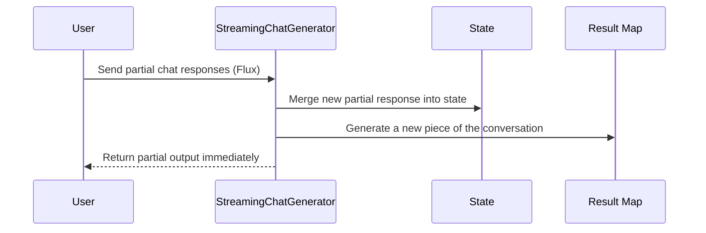

# Chapter 1: StreamingChatGenerator

Welcome to the very first chapter of our beginner-friendly guide to the `spring-ai` project! Here, we introduce the concept of **StreamingChatGenerator**, a feature that allows your application to produce chat responses **piece by piece**—much like a live news broadcast. Instead of waiting for all responses to finish processing, you can provide partial information **in real time**, giving a more interactive and snappy user experience.

---

## What Problem Does It Solve?

Imagine you have a chatbot that needs to generate responses that might take a while to complete (for example, because it’s calling multiple services or reasoning with a large dataset). If you make your users wait until the whole output is ready, they might get frustrated by the silence. **StreamingChatGenerator** helps by sending back partial responses right away, so the conversation feels more natural and lively.

---

## A Simple Use Case

Let’s say you’re building a **customer support chatbot**. The chatbot might need to:

1. Greet the user.
2. Fetch relevant data from external services.
3. Combine all info into a final answer.

Without streaming, your user would see nothing until the entire final answer is ready. With **StreamingChatGenerator**, the user can see progress updates, like:

- “Hello, let me gather some information…”
- “Thank you for waiting, I’m checking your account details…”
- “All set! Here’s the final answer: ...”

This real-time feedback helps build trust and engagement.

---

## Key Concepts of StreamingChatGenerator

### 1. Splitting the Response into Pieces

Instead of sending a complete response in one shot, partial “chunks” of conversation are generated. Each chunk is a piece of text or data that the user sees immediately.

### 2. Builder Pattern for Configuration

**StreamingChatGenerator** provides a `Builder` class that lets you configure how to merge these chunks. You can specify things like:

- Which node (or starting point) the conversation uses.  
- The initial state of your agent (like memory or context data).  
- How to map a full or partial response to a final result (e.g., converting system messages into an easy-to-read format).

### 3. Merging Messages Internally

Under the hood, each new partial response is combined with the previous ones (think of it like appending new sentences to an ongoing conversation) before being sent out, so it feels like one continuous flow.

---

## Using StreamingChatGenerator Step-by-Step

Let’s walk through how you might set this up in code. Our goals:

1. Configure the generator’s builder.  
2. Pass a stream (Flux) of partial chat responses.  
3. Get an **AsyncGenerator** that handles everything under the hood.

### 1. Create the Builder

Below is a simplified snippet to create the builder object. We’ll skip some details for clarity:

```java
// Step 1: Create a builder
var myBuilder = StreamingChatGenerator.builder();
```

Here, `builder()` returns a **Builder** instance that we can customize. This is where we set our starting node, initial state, and more.

### 2. Configure Its Behavior

We can chain our configuration calls for clarity:

```java
// Step 2: Configure the builder
myBuilder
    .startingNode("welcome-node")              // Step 2a
    .startingState(myInitialState)             // Step 2b
    .mapResult(chatResponse -> {               // Step 2c
        // Convert the chat response into a map
        return Map.of(
            "summary", chatResponse.toString()
        );
    });
```

Beginners Tip:
- `startingNode("welcome-node")` might represent the conversation’s first step.  
- `startingState(myInitialState)` is where you store initial data (like who the user is, any context, etc.).  
- `mapResult(...)` is a function that turns each final chat response into a **Map**. This could be useful if you need the final data in a custom format (e.g., JSON).

### 3. Build the Streaming Flow

Now, let’s pass a stream (Flux) of partial responses to `build()`:

```java
// Step 3: Build the generator with a stream of partial responses
Flux<ChatResponse> partialResponses = Flux.just(
    /* Some partial ChatResponse items here */
);

var asyncGenerator = myBuilder.build(partialResponses);
```

- `partialResponses` is a sequence of `ChatResponse` objects. Each `ChatResponse` might have a piece of the conversation from the AI.  
- The **build** method returns an `AsyncGenerator`. You can then consume the streaming responses as they come in.

---

## Under the Hood: How It Works

Conceptually, here’s the rough sequence:



1. **User** (or an external source) pushes partial responses into the **StreamingChatGenerator**.  
2. **StreamingChatGenerator** merges these responses with the existing conversation **State**.  
3. It creates or updates the **Result Map** (using your `mapResult` function).  
4. Finally, it sends the partial response right back to the **User** without waiting for completion.

---

## Curious About the Implementation?

Here’s a simplified look at the core logic found inside `StreamingChatGenerator.Builder` (in `StreamingChatGenerator.java`). The builder configures the flow and merges partial messages:

```java
public Builder<State> mapResult(
   Function<ChatResponse, Map<String,Object>> mapResult
) {
   this.mapResult = mapResult;
   return this;
}
```

- This method accepts a function that maps each final `ChatResponse` to a `Map<String, Object>`.

```java
public Builder<State> startingNode(String node) {
   this.startingNode = node;
   return this;
}
```

- Here, you set your conversation’s first node.

```java
public AsyncGenerator<? extends NodeOutput<State>> build(
   Flux<ChatResponse> flux
) {
   // merges partial responses and returns an AsyncGenerator
   // ...
   return FlowGenerator.fromPublisher(
         FlowAdapters.toFlowPublisher(processedFlux),
         () -> mapResult.apply(result.get())
   );
}
```

- This is where all the ideas come together: the `Builder` merges partial responses (inside `processedFlux`) and uses the `mapResult` function on the final message.

---

## Conclusion

In this chapter, you learned about:
- What **StreamingChatGenerator** does and why it’s important.  
- A simple use case where partial responses boost user experience.  
- How the builder pattern helps you configure streaming.  
- The flow of data under the hood.

By seeing partial results as they’re generated, your chatbot or AI service can feel far more interactive. In the upcoming chapter, we’ll talk about another important piece of the puzzle: [SpringAIToolService](02_springaitoolservice_.md). There, you’ll learn how tools interact with your AI system to perform actions and retrieve data.

Feel free to re-visit this chapter any time you need a refresher on how to create streaming chat experiences. Ready to continue your journey? Check out [SpringAIToolService](02_springaitoolservice_.md) next!

---

Generated by [AI Codebase Knowledge Builder](https://github.com/The-Pocket/Tutorial-Codebase-Knowledge)