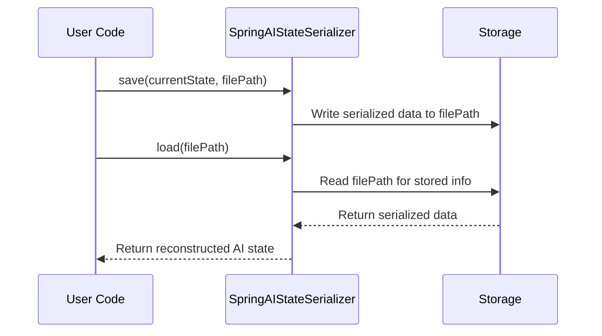

# Chapter 3: SpringAIStateSerializer

In the [previous chapter on SpringAIToolService](02_springaitoolservice_.md), we learned how your AI system can look up and run various “tools” to do things like check inventory or send emails. Now, let’s explore a different but equally important piece of the puzzle: **SpringAIStateSerializer**. This handy class makes sure your AI’s “brain” state can be saved and reloaded without losing any of the important details.

---

## Why Do We Need SpringAIStateSerializer?

Imagine playing a long video game. You probably don’t want to start from the very beginning every time you launch the game. Instead, you rely on a “save file” to pick up exactly where you left off, with all your items, progress, and story details intact. **SpringAIStateSerializer** does the same for your AI system’s internal state (the conversation history, the agent’s context, and any data it’s holding onto).

• It packages up all the AI’s important information.  
• You can store it somewhere safe (a file, a database, etc.).  
• When you reload it, the AI instantly remembers where the conversation left off.

---

## A Simple Use Case

Picture a **customer-support chatbot** that has had a lengthy conversation with a user. The user steps away for a few hours, then returns to continue the conversation:

1. The chatbot must remember who the user is and what was already discussed.  
2. The chatbot must keep its context, so it doesn’t repeat the same questions.  
3. If you shut down or restart the server, you need to reload this chatbot’s “memory” to continue seamlessly.

**SpringAIStateSerializer** is how we store that “memory,” so we can restore it later without losing continuity.

---

## Key Concepts

1. **Serialization** – Converting the AI’s in-memory state into a format that can be written to a file or database.  
2. **Deserialization** – Reading that file or database entry back into the AI’s internal structures.  
3. **Context Preservation** – Ensuring that loaded data (conversation history, agent data) is exactly how you left it.  

In other words, **SpringAIStateSerializer** ensures that your AI’s state is consistent and safe, like a well-organized save file.

---

## How to Use SpringAIStateSerializer

Below is a very simplified code snippet to show creating a serializer instance. We’ll skip deeper details to focus on the basics:

```java
// Step 1: Instantiate the serializer with a factory that knows how to create AgentState.
var serializer = new SpringAIStateSerializer<>(myStateFactory);

// Step 2: Use 'serializer.save(state, outputPath)' to store the AI's state.
// Step 3: Later, use 'serializer.load(inputPath)' to restore the state.
```

Explanation:

• `myStateFactory` is something that knows how to create a blank or default AI state object.  
• `serializer.save(...)` will convert your state into a storable form (e.g., a file on disk).  
• `serializer.load(...)` will read that file back, returning the state exactly as it was.

---

## Under the Hood: What Happens On Save & Load

Below is a quick look at the process in a simple diagram. We’ll name the participants “User Code,” “SpringAIStateSerializer,” and “Storage”:



1. **Saving**: You call `serializer.save(...)`, and SpringAIStateSerializer writes a serialized version of your AI state to disk (or some other storage).  
2. **Loading**: You call `serializer.load(...)`, and SpringAIStateSerializer reads that saved file, reconstructs the AI’s state object, and returns it to your code.

---

### A Peek at the Internal Implementation

Here’s a slimmed-down look at the constructor in the actual code (found in “SpringAIStateSerializer.java”):

```java
public SpringAIStateSerializer(AgentStateFactory<State> stateFactory) {
    super(stateFactory);
    mapper().register(Message.class, new MessageSerializer());
    mapper().register(AssistantMessage.ToolCall.class, new ToolCallSerializer());
    mapper().register(ToolResponseMessage.ToolResponse.class, new ToolResponseSerializer());
}
```

Explanation:

• `super(stateFactory)` tells the parent class how to create new state objects.  
• `mapper().register(...)` lines say “Hey, when you see a Message or ToolCall or ToolResponseMessage, use these special ‘mini-serializers’ to handle them.”

This means that besides storing the basic state, it also saves any conversation messages or tool call details exactly the way they need to be.

---

## Conclusion

That’s it! **SpringAIStateSerializer** is your AI’s “memory card,” so it can pause and resume conversations at any time. By pairing it with [SpringAIToolService](02_springaitoolservice_.md) and other features, your AI system becomes more robust and user-friendly. 

In the next chapter, we’ll explore [MessageSerializer](04_messageserializer_.md), which handles how individual chat messages are turned into data objects and back again. See you there!

---

Generated by [AI Codebase Knowledge Builder](https://github.com/The-Pocket/Tutorial-Codebase-Knowledge)